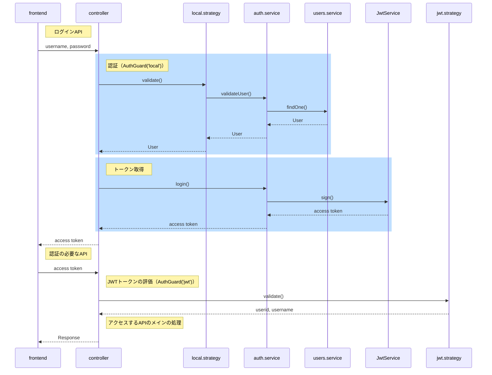

NestJS では、JWT を使った認証機能が公式で紹介されていて良い感じに実装できる。
[Authentication | NestJS - A progressive Node.js framework](https://docs.nestjs.com/security/authentication)

ただ、NestJS の Guard って機能が使われていたり、`@nestjs/passport`の独自仕様的なものがあったりして、動きがわかりずらく初見じゃ辛い。シーケンス図があればいいのになと思ったので書いてみた。

シーケンス図書くと、整理されるので良き。
