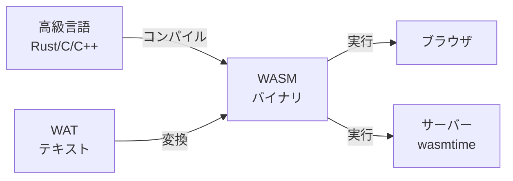
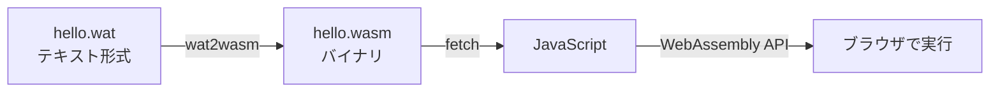
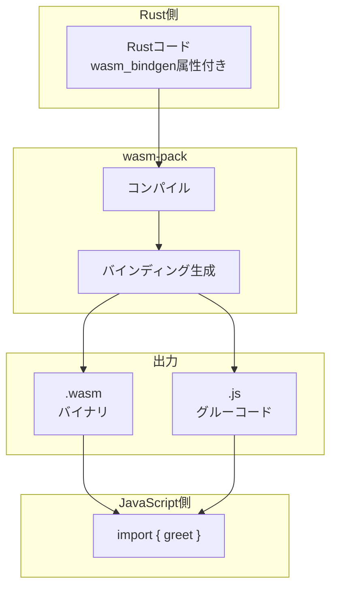
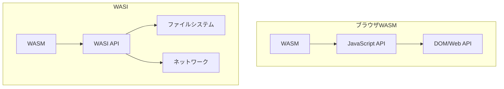
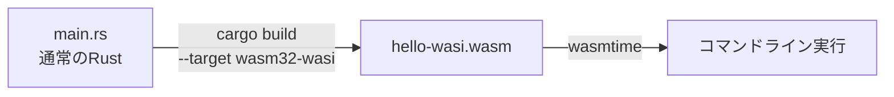

# WebAssembly Hello World 3 つのアプローチ

WebAssembly を学ぶための実践的なチュートリアル集です。3 つの異なるアプローチで、WebAssembly の基礎から実践まで段階的に学べます。

**📦 リポジトリ**:
https://github.com/optimisuke/hello-wasm-with-ai

すべてのサンプルコードは上記リポジトリで公開しています。クローンして手元で試してみてください。

```bash
git clone https://github.com/optimisuke/hello-wasm-with-ai.git
cd hello-wasm-with-ai
```

## 1. はじめに

### WebAssembly とは何か

WebAssembly（WASM）は、ブラウザで高速に動作するバイナリ形式のコードです。C/C++、Rust、Go などの言語で書かれたコードをコンパイルし、JavaScript と並行して Web ブラウザで実行できます。

### なぜ WebAssembly を学ぶのか

- **高速性**: JavaScript よりも高速な実行が可能
- **移植性**: 既存の C/C++/Rust コードをブラウザで動かせる
- **安全性**: サンドボックス環境で安全に実行
- **汎用性**: ブラウザだけでなく、サーバーサイドやエッジでも動作

### この記事で学べること

このリポジトリでは、3 つの異なるアプローチで WebAssembly を体験できます：

1. **WAT（WebAssembly Text Format）** - WebAssembly の基本を理解する
2. **Rust + wasm-pack** - ブラウザ上で WebAssembly を動かす実践的な方法
3. **WASI** - ブラウザ外で WebAssembly を動かす

## 2. WebAssembly の基礎知識

WebAssembly は**バイナリ形式**のコードで、人間が直接読み書きするのは困難です。そのため、テキスト形式の**WAT**や、Rust などのプログラミング言語から変換して使います。



WebAssembly には大きく 2 つの実行環境があります：

- **ブラウザ**: JavaScript と連携して Web 上で動作
- **サーバー/CLI**: WASI を使ってブラウザ外で動作

## 3. アプローチ 1：WAT - 最もシンプルな入門

### WAT とは

WAT（WebAssembly Text Format）は、WebAssembly のテキスト表現です。テキストで WebAssembly の処理を記載できます。

### 実装の流れ



### コードの解説

```wasm
(module
  ;; JavaScriptからログを出力する関数をインポート
  (import "console" "log" (func $log (param i32)))

  ;; メモリを定義（1ページ = 64KB）
  (memory (export "memory") 1)

  ;; "Hello, WASM!" という文字列をメモリに配置
  (data (i32.const 0) "Hello, WASM!")

  ;; greet関数をエクスポート
  (func (export "greet")
    ;; メモリの0番地を渡してログ出力
    i32.const 0
    call $log
  )
)
```

**ポイント**:

- `import`: JavaScript の関数を WASM から呼び出せるようにする
- `memory`: WASM と JavaScript 間でデータを共有するメモリ領域
- `export`: WASM の関数を JavaScript から呼び出せるようにする

### 学べること・メリット

- ✅ WebAssembly の基本構造を理解できる
- ✅ メモリの仕組みが分かる
- ✅ JavaScript 連携の基礎が学べる
- ✅ 最小限のツールで動作確認できる

**→ 詳細は [1-hello-wat](https://github.com/optimisuke/hello-wasm-with-ai/tree/main/1-hello-wat) へ**

## 4. アプローチ 2：Rust + wasm-pack - 実践的な開発

### なぜ Rust なのか

Rust は、WebAssembly の開発において最も人気のある言語です：

- メモリ安全性が保証される
- 優れたツールチェーン（wasm-pack、wasm-bindgen）
- 高速でコンパクトな WASM を生成
- JavaScript との連携が簡単

### wasm-bindgen の役割



wasm-bindgen は、Rust と JavaScript 間の型変換やメモリ管理を自動的に処理し、`.wasm`バイナリと`.js`グルーコードを生成します。

### 実装の流れ

```rust
use wasm_bindgen::prelude::*;

// JavaScriptのalert関数をインポート
#[wasm_bindgen]
extern "C" {
    fn alert(s: &str);
}

// greet関数をJavaScriptにエクスポート
#[wasm_bindgen]
pub fn greet(name: &str) {
    alert(&format!("Hello, {}!", name));
}
```

**ポイント**:

- `#[wasm_bindgen]`属性で関数を自動的にエクスポート
- 文字列などの複雑な型も自動変換
- TypeScript 型定義も自動生成

### 学べること・メリット

- ✅ 実際のプロジェクトで使える構成
- ✅ 型安全な JavaScript 連携
- ✅ 複雑なデータ構造の扱い方
- ✅ モダンなツールチェーンの活用

**→ 詳細は [2-hello-rust](https://github.com/optimisuke/hello-wasm-with-ai/tree/main/2-hello-rust) へ**

## 5. アプローチ 3：WASI - ブラウザの外へ

### WASI とは何か

WASI（WebAssembly System Interface）は、WebAssembly をブラウザの外で実行するための標準インターフェースです。ファイルシステム、ネットワークなどのシステムリソースにアクセスできます。

### ブラウザ版 WASM との違い



| 項目         | ブラウザ           | ブラウザ以外 (+WASI)       |
| ------------ | ------------------ | -------------------------- |
| 実行環境     | ブラウザ           | コマンドライン、サーバー   |
| API          | JavaScript/Web API | WASI                       |
| ユースケース | Web アプリ         | CLI ツール、サーバーアプリ |
| ランタイム   | ブラウザ内蔵       | wasmtime、wasmer 等        |

### 実装の流れ



### コードの解説

```rust
fn main() {
    println!("Hello, WASI!");
}
```

通常の Rust コードそのままです。`println!`マクロは、WASI の標準出力 API に自動的に変換されます。

### 学べること・メリット

- ✅ ブラウザ不要の WASM 実行
- ✅ システムリソースへのアクセス
- ✅ サーバーサイドアプリケーションの可能性
- ✅ ポータブルなバイナリの作成

**→ 詳細は [3-hello-wasi](https://github.com/optimisuke/hello-wasm-with-ai/tree/main/3-hello-wasi) へ**

## 6. 3 つのアプローチの比較

| 項目                | WAT              | Rust + wasm-pack           | WASI                |
| ------------------- | ---------------- | -------------------------- | ------------------- |
| **実行環境**        | ブラウザ         | ブラウザ                   | コマンドライン      |
| **言語**            | WAT              | Rust                       | Rust                |
| **ツール**          | wabt (wat2wasm)  | wasm-pack                  | wasmtime, cargo     |
| **学習目的**        | WASM の内部理解  | 実践的な Web 開発          | サーバーサイド WASM |
| **ユースケース**    | 教育             | ブラウザでの高度な計算処理 | CLI、プラグイン     |
| **JavaScript 連携** | 手動（低レベル） | 自動（高レベル）           | なし                |

### どれから始めるべきか

**🎯 推奨学習順序**:

1. **まずは [1-hello-wat](https://github.com/optimisuke/hello-wasm-with-ai/tree/main/1-hello-wat)**

   - WebAssembly の基本概念を理解
   - メモリやインポート/エクスポートの仕組みを学ぶ

2. **次に [2-hello-rust](https://github.com/optimisuke/hello-wasm-with-ai/tree/main/2-hello-rust)**

   - 実践的なツールチェーンに慣れる
   - 実際のプロジェクトで使える知識を習得

3. **最後に [3-hello-wasi](https://github.com/optimisuke/hello-wasm-with-ai/tree/main/3-hello-wasi)**
   - WebAssembly の可能性を広げる
   - サーバーサイド活用を検討

**目的別の選択**:

- 🔍 **WebAssembly を深く理解したい** → WAT
- 🚀 **Web アプリに組み込みたい** → Rust + wasm-pack
- ⚙️ **CLI ツールを作りたい** → WASI

## 7. まとめ

WebAssembly は、Web 開発の新しい可能性を開く技術です。この 3 つのアプローチを通じて：

- **WAT**で WebAssembly の本質を理解し
- **Rust + wasm-pack**で実践的な開発手法を学び
- **WASI**でブラウザを超えた活用方法を知る

ことができます。

## 参考

https://zenn.dev/optimisuke/articles/b96ecf48ee08af
