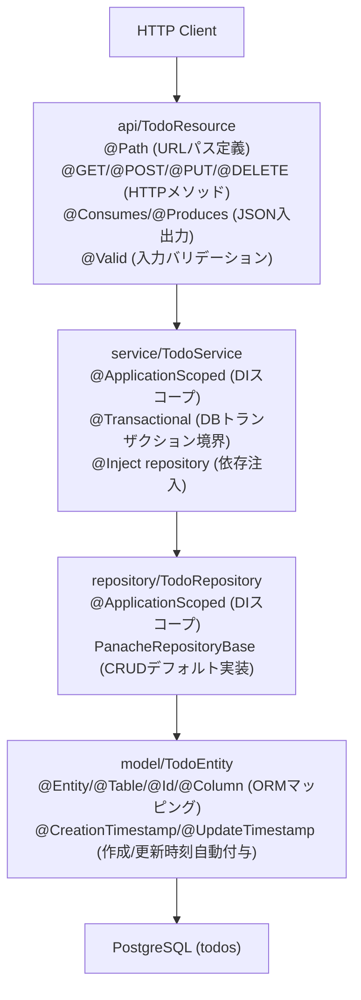

## はじめに

Quarkus 気になり出して触ってみたので共有です。本記事にはコードは書いてないので、ぜひ GitHub 見てください。

https://github.com/optimisuke/hello-otel/tree/main/quarkus-app

## Quarkus???

Quarkus はネイティブビルドができて起動が速くて、コンテナイメージを小さくできるクラウドネイティブな Java フレームワーク。Jakarta EE/JAX-RS/CDI/Hibernate を軽量にまとめた感じで、Java 版 NestJS みたいな開発者体験なのに、ビルド時最適化が効いて Go 的要素もあってクラウドネイティブなのが売り。RedHat が作ってるのも安心感ある。もしかして最高か？

https://www.redhat.com/ja/topics/cloud-native-apps/what-is-quarkus

触る前に気になったのはここらです。

- 名前
- バイナリコードにビルドできる
- CLI でコンテナも生成できる

名前は、Quark + us らしいです。物理学科卒としては見逃せない命名です。Leptonus とか Bosonus とかいうフレームワークも作りたくなりますね。（重要：クォークもレプトンもボソンも素粒子の種類。）

> QUARK: elementary particle / US: hardest thing in computer science

ここに書かれてました。
https://events.redhat.com/accounts/register123/redhat/events/7013a000002cwheaa0/Kubernetes_Native_with_Quarkus_-_Finnigan.pdf

クォークは陽子とか中性子の構成要素です。強い相互作用が働きます。
https://ja.wikipedia.org/wiki/%E3%82%AF%E3%82%A9%E3%83%BC%E3%82%AF

利用具合は、去年(2024 年)時点で Spring Boot -> Tomcat -> Quarkus になっており、結構人気みたいです。なぜか日本語の記事あまり見かけません。日本じゃ流行ってないんですかね。
https://jakarta.ee/blogs/key-takeaways-cloud-native-java-survey/

## 触ってみた

TODO アプリの API を作ってみました。あまり触ったことないけど、NestJS とか Express + TypeORM っぽくアノテーションを着けまくる感じです。

コードここにおきました。

https://github.com/optimisuke/hello-otel/tree/main/quarkus-app

やったことはシンプルで、Todo の CRUD とヘルスチェック、DB は PostgreSQL。ローカルでは `./mvnw quarkus:dev` で dev モード起動、ネイティブビルドは `./mvnw package -Dnative` で GraalVM 使った実行ファイルをビルドできる（最適化されたコンテナも `./mvnw quarkus:image-build` で作れちゃう）。

## アーキテクチャ

Resource → Service → Repository → Entity で PostgreSQL に到達し、Bean Validation が DTO を検証、例外ハンドラが 400/422 を整形します。エントリポイントやルーターは Quarkus がビルド時に生成し、設定は `application.properties` に集約されています。

ざっくり役割はこんな感じ。

- JAX-RS でエンドポイント定義（`@Path`, `@GET` など）
- CDI (Contexts and Dependency Injection) で DI/スコープ管理（`@Inject`, `@ApplicationScoped`）
- Panache (Hibernate) で DB CRUD（`PanacheRepositoryBase` のデフォルト実装）
- Bean Validation で入力検証（`@Valid`, `@NotBlank` など）

（NestJS も Controller / Provider / Repository / DTO みたいな分担があって、レイヤーがきっちり準備されてて似てる。）

各用語については後述。

- 例外ハンドラ: `exception/*Mapper` (@Provider 実装で 400/422 を整形)。
- DTO: `CreateTodoRequest` / `UpdateTodoRequest` / `TodoResponse` は `record` + Bean Validation（`@NotBlank`, `@Size` など）。
- Health: `api/HealthResource` (@Path("/health"), @NonBlocking) で疎通確認。
- Bean Validation: フィールドに制約アノテーションを付けるとリクエスト受信時に自動検証し、違反時は 400。
- @Provider: JAX-RS の拡張ポイント登録用アノテーション。ExceptionMapper などに付けると例外を横取りしてカスタムレスポンスを返せる。

## 用語の整理（JAX-RS / CDI / Panache / Hibernate）

- JAX-RS: REST API を定義する Jakarta EE 標準仕様（`@Path`, `@GET/@POST/@PUT/@DELETE`, `@Consumes`, `@Produces`, `@PathParam`, `@QueryParam` など）。
- Quarkus REST: 旧称 RESTEasy Reactive。上記 JAX-RS アノテーションを解釈する Quarkus 標準 REST スタック。Express/NestJS でいうところの Controller レイヤ。
- CDI: Jakarta EE の DI 仕様。`@Inject` で依存注入し、`@ApplicationScoped` などのスコープでライフサイクルを管理。Quarkus では Arc が実装（NestJS の Provider/Injectable 的な立ち位置）。
- Arc: Quarkus の CDI 実装（軽量・ビルド時最適化版）。起動前に Bean を解析して高速化し、ネイティブイメージでも動くように設計されている。
- Bean: CDI コンテナ（Arc）が管理するオブジェクトの単位。DI 対象となり、スコープ（例: `@ApplicationScoped`）やライフサイクルがコンテナにより制御される。
- Panache: Quarkus が提供する Hibernate ORM の薄いラッパー。`PanacheRepositoryBase` を実装するだけで `persist`, `find`, `list`, `delete` などの CRUD ヘルパーが使える（TypeORM の Repository をもう少し手厚くしたポジション）。
- Hibernate ORM: Red Hat 主導の JPA 実装。エンティティ（`@Entity`, `@Id`, `@Column`）とテーブルをマッピングし、JPQL/HQL/ネイティブ SQL を扱う。Panache はこれを使いやすく包んだ Quarkus 拡張。

## 感想

触ってみて感じたことはここらです。

- main はどこ？エントリポイントはどこ？フレームワークがやってくれる前提っぽい。宣言的にコンポーネントを足してく感じか
- 枠組みしっかりしてるから、誰が作っても似てくるんじゃないか → メンバー入れ替わってもオンボーディングコスト低くて、やりやすそう
- あれ？OTel は Java Agent じゃないのか。ビルドするし。OTel SDK を隠蔽して、ビルド時にうまいことやってくれてそう。
- 技術選定楽そう。基本は Quarkus が諸々準備してくれてそう。RedHat を信じることでいろんな選定から解放されそう（期待）。
- ローカル環境で java runtime 使って立ち上げる時と本番環境向けにコンテナイメージをビルドする時とで、設定がちゃんと読み込まれるかちゃんと考えないといけなさそう。→OTel の設定がいまいちうまくいかなかった。`quarkus.opentelemetry.*` を application.properties に書きつつ、最終的には環境変数（`QUARKUS_OPENTELEMETRY_ENDPOINT` など）で上書きしたら動いた。ビルド時に読まれるっぽい設定もあるので dev と prod で分けてちゃんと確かめるのが必要そう。
- ネイティブビルドも試したけど、ビルド時間はそれなり（数分）でも上がってしまえば起動めっちゃ速いしコンテナも小さめ（100MB くらい）。

DB アクセス時のトレースも見れた。

## おわりに

Quarkus っていう RedHat がつくってる Java のフレームワークをさわりはじめたけど、Java をクラウドネイティブなカタチに再構築してていろいろすごい。
大企業は Go とか Python とか TypeScript に浮気せずにこれでいんじゃね？ガバナンスも効かせやすそうだし、Java 資産や Java 人材もいかせてオンボーディングコストも最小限でモダナイズできそう。
