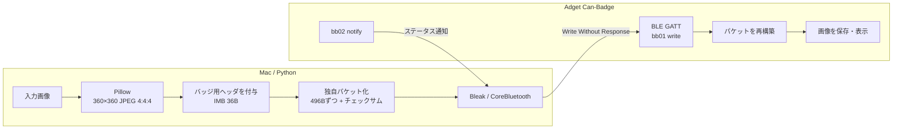
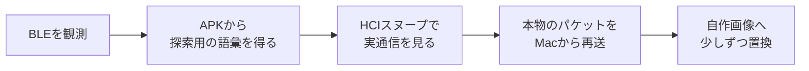

# はじめに

みなさんハックしてますか？わたしは、最近、[Adget Can-Badge](https://adget.tokyo/products/adget-canbadge)という、スマホから画像や動画を送れるデジタル缶バッジを買ってごにょごにょ遊んでました。メインは「推し活」用っぽいですが、小さな表示デバイスとして何か使えそうだったので買っちゃいました。

https://x.com/optimisuke/status/2078418105827574145

[youtoyさん](https://qiita.com/youtoy)の[イベントに便利そうなデジタル缶バッジの記事](https://qiita.com/youtoy/items/cf186a27c996e8bc8ee7)やXで見かけたので気になってました。その後、すこし調べたのですがハックしてる人もいなさそうだったので買うのに躊躇してました。でも、今はAIがいるし、なんとかなるかなと思いAmazonプライムデー？で買っちゃいました。

はじめ、Macから直接データを送れたらClaudeとかCodexの進捗を表示できるかなとか、バッジのタッチ操作でClaude CodeとかCodexを操作できるかなと期待してましたが、試した感じ正直難しそうです。。。とりあえずは、既存のBLE機能つかってMacから画像を送るのを目標に試すことにしました。ちなみに、この製品にはちゃんと技適表示があります。すばらしい。ただ、ファームウェアを変更したら適合性あやしくなると思うので、本体は変更せずに既存のBLEのプロトコルのみごにょごにょすることにしました。

ちなみに、試す前は、Bluetooth、Android、Flutter、逆コンパイル、スヌーピングは、どれも概要を知っている程度でした。予備知識として役立ちましたが、必須ではなかったと思います。AIに何をしているか質問して理解すれば、知らない領域でも似たようなことできそうでした。最終的には、MacからPythonで自作画像を送れるようになり、かなり満足できました🎉

今回、調査と実装はAIに任せましたが、AIまじですごいっすね。
いままで自分の理解している範囲でしかタスクをわたせてなかったなーと思いました。
自分の理解を広げるためにもいろんなタスクをお願いすべきですね。

https://x.com/optimisuke/status/2078483528715837647

:::message
自分で購入した機器、自分の端末、自分の通信だけを調べています。APKや生の通信ログは公開していません。同様の調査では、利用規約や適用法を各自で確認してください。
:::

# 作ったもの

最終的なプログラムはシンプルです。

```bash
python send_image.py send image.png
```

Mac側で画像をCan-Badge独自形式へ変換し、[Bleak](https://bleak.readthedocs.io/)からBLEで送ります。



IMBは画像サイズや幅・高さを持つ36バイトの独自ヘッダです。画像は正規アプリと同じ496バイトずつに分割し、各パケットへ1バイトのチェックサムを付けます。これらはBLEの共通仕様ではなく、実通信から判明したCan-Badge独自形式です。

# どう解析したか

最初からアプリを完全に解析せず、簡単に取得できる情報から順に進めました。



実際にやったことは次の4つです。

1. **BLEを観測する**
   Can-Badgeへ接続し、GATT（BLE接続後にデータを読み書きする仕組み）を調べました。Notification（デバイス側から届く通知）から平文JSONが見つかり、長さやチェックサムをPythonで確認しました。
2. **Androidアプリも調べる**
   BLEスキャンだけでは画像の送り方までは分かりません。アプリはFlutter製だったため、Dartがコンパイルされた`libapp.so`から、ファイル分割や書き込みの流れをAIが追いました。
3. **実際の通信を見る**
   静的解析だけではわかることが減ってきたので、Androidの[Bluetooth HCIスヌープ](https://developer.android.com/studio/debug/dev-options.html)へ切り替えました。正規アプリの通信から、独自ヘッダと360×360のJPEGを分割送信していることが分かりました。
4. **本物から少しずつ置き換える**
   まず正規アプリのパケットをMacから再送し、BLE経路を確認しました。次に自作画像へ置き換え、JPEGの4:2:0と4:4:4（色情報をどれだけ省略するか）の差まで絞り込みました。正規アプリと同じ4:4:4へ変更すると成功しました。

AIも、いきなり全部を完成させるのではなく、動くところから少しずつ確認していました。このあたりのアプローチは、人間がデバッグするときと同じですね。

# AIと人の役割

AIの進め方は、意外というか想定通りというか堅実でした。

- 簡単に取得できる情報から始める
- 候補は実データで確認する
- 行き詰まったら目的へ戻り、別の観測方法を試す
- 小さな解析スクリプトを何度でも作る

途中でClaude Codeの上限に達しましたが、確定事項、仮説、失敗、次の操作を`NOTES.md`へ残していたため、Codexがそのまま続行できました。長い調査では、事実と仮説を分けたメモを残してもらうと役立ちます。人間と同じかよ。

一方、Mac側からのBLE通信が成功しても、画像が実機に保存されたとは限らないので。「更新中だが保存されていない」「今度は表示された」と確認するのは自分の担当でした。なんかしょうもない役割だなと思いつつ実機を見て教えてあげてました。目を持たせたら、もっとまかせられるのかもです。

（こっちも読んでね）

https://zenn.dev/optimisuke/articles/wifi-cam-mcp-claude

現状、人が握っておく必要があるのは、次のようなところかと思います。

- いまAIが見ているのは事実か仮説か
- この操作で何を確認するのか
- 検証が妥当か
- 規約等に問題はないか
- AIは伝えられた目的・最終ゴールを忘れてないか

# おわりに

自力でやれって言われたら途中で投げ出していたと思いますが、AIがうまいこと、Macから画像を送るところまでしてくれました。必要なタイミングで仕組みや何をしているか聞くことで、理解も深まった気がします。

今の自分のスキルセットに捉われず、**AIと一緒にできる範囲を更新し続ける**ことが大事だなと思う今日この頃です。技術以外でも、興味はあったけれど時間が足りず諦めていたことを、もう少し試してみようと思います。マーケティング気になってるなう。

# 参考資料

- [Android Developers: Configure on-device developer options](https://developer.android.com/studio/debug/dev-options.html)
- [Bluetooth SIG: The Bluetooth Low Energy Primer](https://www.bluetooth.com/bluetooth-le-primer/)
- [Bleak documentation](https://bleak.readthedocs.io/)
- [Adget公式: Adget Can-Badge](https://adget.tokyo/products/adget-canbadge)
