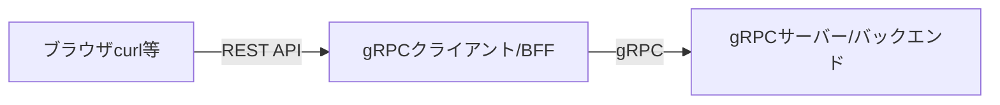

# はじめに

gRPC の勉強はじめました。
gRPC って Go 言語の情報はそこそこ充実しているけれど、それ以外の言語の情報は少ない気がします。
色々調べたり、自動生成されたコード読んだりしながら、gRPC のサーバーとクライアントを両方 TypeScript で試したので共有します。

下記 3 点を整理してます。

1. TypeScript でサーバーとクライアントを作る
2. TypeScript で[Metadata](https://grpc.io/docs/what-is-grpc/core-concepts/#metadata)を追加する
3. [Evans](https://github.com/ktr0731/evans)で動作確認

特に 2 番目のメタデータを追加する部分の事例があまり見当たらなかったので、誰かの参考になればと思います。

ちなみに、gRPC のキャラクターは Golden Retriever の PanCakes くんらしいです。いい感じ。

[Dear gRPC | gRPC](https://grpc.io/blog/hello-pancakes/)
https://twitter.com/grpcio

# 1. TypeScript でサーバーとクライアントを作る

最初に、下記メルカリエンジニアリングブログのコードを試した。
[OK Google, Protocol Buffers から生成したコードを使って Node.js で gRPC 通信して | メルカリエンジニアリング](https://engineering.mercari.com/blog/entry/20201216-53796c2494/)

すごくシンプルにまとまっていて、わかりやすかった。

構成はこんな感じ。



`config`が書かれていなくて、そのまま動かなかったので、下記を追加修正した。

なんとなく、gRPC のポートは 10000 にしてみた。
（Evans だとデフォルトは 50051 になってた）

```typescript:config.ts
export const port = 10000;
export const BFFPort = 9000;
```

`grpcClientOptions`は、なくても動きそうやったので、一旦削除。

```diff ts:helloClient.ts
- import { grpcClientOptions, port } from "../config";
+ import { port } from "../config";


  const Client = new GreeterClient(
    serverURL,
-    credentials.createInsecure(),
-    grpcClientOptions
+    credentials.createInsecure()
  );
```

[メルカリブログ](https://engineering.mercari.com/blog/entry/20201216-53796c2494/)に書かれているように、`npm run dev`した後、ブラウザで確認したら、いい感じに動いた。

# 2. TypeScript で[Metadata](https://grpc.io/docs/what-is-grpc/core-concepts/#metadata)を追加する

gRPC も HTTP/1.1 と同じようにヘッダー情報みたいなのを[Metadata](https://grpc.io/docs/what-is-grpc/core-concepts/#metadata)として追加できる。
key-value 型の情報。
言語ごとにメタデータお追加する方法が違うので、TypeScript でメタデータを扱うときどうするのか調べた。

## Client -> Server

Client から Server に送るとき、クライアントはこんな感じ。すごくシンプル。
認証系の情報をメタデータに入れたくなったら、こんな感じでやったら良いはず。

```diff ts:helloClient.ts
import {
+    Metadata,
    sendUnaryData,
    Server,
    ServerCredentials,
    ServerUnaryCall,
} from "@grpc/grpc-js";


    return new Promise((resolve, reject) => {
        const meta = new Metadata();
+        meta.add('hoge', 'from client');

-       Client.sayHello(Request, (error, response) => {
+       Client.sayHello(Request, meta, (error, response) => {
            if (error) {
                console.error(error);
                reject({
                    code: error?.code || 500,
                    message: error?.message || "something went wrong",
                });
            }
            return resolve(response.toObject());
        });
    });
```

ちなみに、自動生成されたクライアントのクラスはこんな感じ。metadata はなくても送れる。

```ts:helloworld_grpc_pb.d.ts
export class GreeterClient extends grpc.Client implements IGreeterClient {
    constructor(address: string, credentials: grpc.ChannelCredentials, options?: Partial<grpc.ClientOptions>);
    public sayHello(request: proto_helloworld_pb.HelloRequest, callback: (error: grpc.ServiceError | null, response: proto_helloworld_pb.HelloReply) => void): grpc.ClientUnaryCall;
    public sayHello(request: proto_helloworld_pb.HelloRequest, metadata: grpc.Metadata, callback: (error: grpc.ServiceError | null, response: proto_helloworld_pb.HelloReply) => void): grpc.ClientUnaryCall;
    public sayHello(request: proto_helloworld_pb.HelloRequest, metadata: grpc.Metadata, options: Partial<grpc.CallOptions>, callback: (error: grpc.ServiceError | null, response: proto_helloworld_pb.HelloReply) => void): grpc.ClientUnaryCall;
}
```

ちなみに、ちなみに、`grpc.CallOptions`はこんな感じ。色々設定できそう（せなあかんとも言う）。

```ts:client.d.ts
export interface CallOptions {
    deadline?: Deadline;
    host?: string;
    parent?: ServerUnaryCall<any, any> | ServerReadableStream<any, any> | ServerWritableStream<any, any> | ServerDuplexStream<any, any>;
    propagate_flags?: number;
    credentials?: CallCredentials;
    interceptors?: Interceptor[];
    interceptor_providers?: InterceptorProvider[];
}
```

サーバーはこんな感じでメタデータを取り出せる。シンプル。

```diff ts:index.ts
function sayHello(
    call: ServerUnaryCall<HelloRequest, HelloReply>,
    callback: sendUnaryData<HelloReply>
) {
    const greeter = new HelloReply();
    const name = call.request.getName();
+    console.log(call.metadata.get('hoge'));

    const message = `Hello ${name}`;

    greeter.setMessage(message);
    callback(null, greeter);
}
```

参考：[node.js - How to add metadata to nodejs grpc call - Stack Overflow](https://stackoverflow.com/questions/37526077/how-to-add-metadata-to-nodejs-grpc-call)

## Server -> Client

サーバーからクライアントに送る場合は、トレーラーに入れる場合と、ヘッダーに入れる場合がある。
下記サイトがわかりやすかった。Go 言語やけど。
[メタデータの送受信｜作ってわかる！ はじめての gRPC](https://zenn.dev/hsaki/books/golang-grpc-starting/viewer/metadata)

ヘッダーで送るときは、こんな感じ。

```diff ts:index.ts
function sayHello(
    call: ServerUnaryCall<HelloRequest, HelloReply>,
    callback: sendUnaryData<HelloReply>
) {
    const greeter = new HelloReply();
    const name = call.request.getName();
    const message = `Hello ${name}`;
    greeter.setMessage(message);

+     const meta = new Metadata();
+     meta.add('hoge', 'header from server');
+     const status: Partial<StatusObject> = {
+         code: Status.OK,
+         details: "details dayo-",
+         metadata: meta,
+     }

-    callback(null, greeter);
+    callback(status, greeter);

}
```

ただ、これ、`Status.OK`にしてもクライアント側で見るとエラーとして扱われて、`'No message received'`って言われた。メタデータは入ってたけども。なので、正常系でメタデータ送ろうとするとトレーラーに入れなあかんっぽい。受け取る方でも、`metadata`じゃなくて`status`として受け取ってるから、そういう仕様なんかなと思ってる。何か勘違いしてるかもやから、誰か知ってたら教えてほしいです。。。

トレーラーで送るときは、こんな感じ。
こっちは、シンプルに送れる。

```diff ts:index.ts
function sayHello(
    call: ServerUnaryCall<HelloRequest, HelloReply>,
    callback: sendUnaryData<HelloReply>
) {
    const greeter = new HelloReply();
    const name = call.request.getName();
    const message = `Hello ${name}`;
    greeter.setMessage(message);

+    const metaTrail = new Metadata();
+    metaTrail.add('hoge', 'trailer from server');
-    callback(null, greeter);
+    callback(null, greeter, metaTrail);
}
```

クライアントはこんな感じ。
トレーラーで送った場合は`metadata`として認識されて、ヘッダーで送った場合は`status`として認識されてる。なんか、しっくりこないけども。。。

```diff ts:helloClient.ts
- import { credentials } from "@grpc/grpc-js";
+ import { credentials, Metadata } from "@grpc/grpc-js";


    return new Promise((resolve, reject) => {
-        Client.sayHello(Request, (error, response) => {
+        const sayHelloCall = Client.sayHello(Request, (error, response) => {
            if (error) {
                console.error(error);
                reject({
                    code: error?.code || 500,
                    message: error?.message || "something went wrong",
                });
            }

            return resolve(response.toObject());
        });
+         sayHelloCall.on("metadata", metadata => {
+             console.log("metadata from server:" + JSON.stringify+ (metadata));
+         });
+         sayHelloCall.on("status", metadata => {
+             console.log("metadata from server:" + JSON.stringify+ (metadata));
+         });
    });
```

参考：[gRPC における metadata、そしてそれを node.js client から取得する - Qiita](https://qiita.com/kiririmode/items/4fca1b09173a558f44b5)

# 3. [Evans](https://github.com/ktr0731/evans)で動作確認

こんな感じで、アクセスできる。

```bash
echo '{"name": "hoge"}' | evans --proto src/proto/helloworld.proto -p 10000 cli call helloworld.Greeter.SayHello --header hoge=fuga --enrich
```

実行すると、こんなのが表示される。

```bash
content-type: application/grpc+proto
date: Tue, 11 Oct 2022 05:03:50 GMT
grpc-accept-encoding: identity,deflate,gzip

{
  "message": "Hello hoge"
}

hoge: trailer from server

code: OK
number: 0
message: ""
```

TypeScript は[Server Reflection](https://github.com/grpc/grpc/blob/master/doc/server-reflection.md)が実装されてないので、`.proto`を読み込んで実行してる。
（Java とか Go 羨ましい。非公式ならいくつか選択肢ありそう。[Support reflection · Issue #79 · grpc/grpc-node](https://github.com/grpc/grpc-node/issues/79)）

`--header hoge=fuga`でメタデータを送って、`--enrich`で受けたのを表示している（`hoge: trailer from server`）。

ちなみに、Evans もメルカリの人が作ったツール。メルカリすごい。
参考：[gRPC と gRPC クライアントツール Evans | メルカリエンジニアリング](https://engineering.mercari.com/blog/entry/grpc_and_evans/)

# おわりに

最初にも書いたけど、gRPC は Go 言語の情報ばかりな気がします。
いろんな言語で実装したマイクロサービス間をいい感じに繋いでくれるのが、gRPC の特徴でもあるので、もっと他の言語の事例も増えると良いなー。
ということで、引き続き、TypeScript 使って、gRPC 触ってみよかな。
