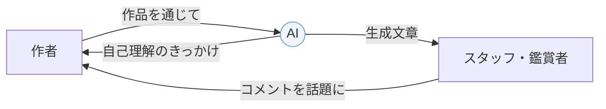
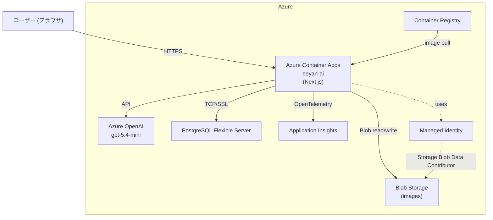
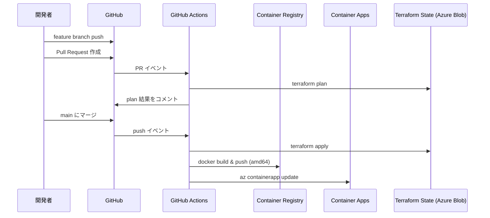

# はじめに

テックルズでエンジニアをしている Naosuke です。テックルズは、福祉業界への深い関心を背景に集まったデザイナーとエンジニアのチームで、AIなどのテクノロジーを活用し、障害のある方々が自己の創造性と表現力を最大限に発揮できる環境の創出を目指しています。

https://note.com/techls

テックルズの活動でも、子育ての場面でも、ずっと感じてきたことがあります。人が作ったものに対して、褒めたり意見を言うのって難しいですよね。「いいですね」だけだと薄いし、かといって「ここが面白い」と言おうとすると、的外れだったり、気まずくなったり、傷つけたりしないか、という気持ちが出てくる。障害のある方々のアート活動の現場だと、さらに難しくなります。

AIを間に挟んだら、その難しさが少し変わりました。AIがコメントを出すことで、「なんか違う」「そうそうそれ！」という会話が自然に始まりました。AIが仲介者になることで、今まで起きなかった対話が生まれる。これは現場で繰り返し確認できたことです。

これはアーティストだけでなく、施設の職員にとっても変化をもたらしました。「何を言えばいいか」という心理的な負担がAIに移ることで、スタッフはアーティストとの対話そのものに集中できるようになる。支援の仕事を効率化しながら、利用者との関係をより深くする——AIエージェントによる業務改革というと大げさに聞こえるかもしれませんが、現場で起きたことはそういうことかと思います。

この体験をもとに、生成AIを使ったアプリを開発・実証し、デザイン学研究作品集（JSSD 2025年）に論文として発表しました。その後、Zenn のMicrosoft Agent Hackathon を見つけたことをきっかけに、アプリをゼロから作り直しました。背景にある活動は数年来のものですが、技術的には完全にリビルドしました。

この記事では、現場での気づきを前半に、作り直したアプリの技術的な記録を後半にまとめています。デモ動画はこちら。長いですが、最後まで読んでいただけるとうれしいです。

https://www.youtube.com/watch?v=TODO


# やってきたこと

## Good Job! センター香芝との取り組み

奈良にある「Good Job! センター香芝（GJC）」は、一般財団法人たんぽぽの家が運営する、障害のある人が制作活動やものづくりに携わる施設です。絵画や陶芸、テキスタイルなど、プロのアーティストとしても活動しているメンバーが在籍しています。

ここ数年、GJC との協働を続けています。デジタルファブリケーションの導入から、アート作品の展示・発信まで、さまざまな角度から関わってきました。

そういった活動の中で、ずっと気になっていたことがありました。**作品はあるけど、その作品を言葉にして外に出す手段がない**、という課題です。いろんな才能のアーティストはいるけれど、作り終わった後、作品について話したり、発信したりするのは、また別のスキルが要る。専門のスタッフがいなければ、その支援はなかなか難しいということです。

## 最初のシステム

そういった背景から、2023年、作品画像をもとに生成AIがコメントを作る Web アプリを開発しました。出力するのは4つ。

- タイトル
- 作品の印象
- ユニークな点
- 次の制作へのヒント

最初は Gradio + Llava（Large Language and Vision Assistant）で試作し、その後 Next.js で作り直して Vercel にデプロイしました。1キャラクターが一発で評価を返すシンプルな設計です。


2024年2月、GJC で実証実験を行いました。GJC から 8 名、アートセンター HANA から 5 名が参加し、累計 37 件の評価アンケートを取りました。結果は好意的なものが多数（「そう思う」13件・「ややそう思う」14件）。同時に、たんぽぽの家主催のセミナーで発表したことをきっかけに、川崎市の NPO・文化財団との連携が始まり、「Colors かわさき展」での活用にもつながりました。


この取り組みをまとめたのが下記の論文です。

> **「障害のある人の表現活動における生成AI活用システムの開発と評価」**
> 緒方嵐浩（九州大学）、伊藤尚祐・高田あかり・竹田周平（日本IBM）
> デザイン学研究作品集 Vol.31 No.1, 2025

# 現場で気づいたこと：AIが仲介者になる

## AIのコメントを見ながら会話が始まった

実証実験でいちばん印象に残っているのは、AIのコメントが「正しい」かどうかより、**AIのコメントをきっかけに会話が生まれた**ことでした。

「まあ、大体合っている」「そうとも言えるかな」という反応。意図通りに読み取られていない場合、「なんか違う」「意図通りに AI に読み取らせるにはどう工夫できるか」という話になります。AIが出した文章を足がかりに、作者が自分の作品について語り始めるんです。

スタッフからもこういうフィードバックをもらいました。

> 「アーティストには経験値やプライドがあるので、なかなかスタッフの意見には耳を傾けてくれないこともある。AIのコメントでは意見を聞いてくれた」

> 「生成AIとの出会いにより作品への自信が芽生え、意欲的に制作に取り組んでいる」

> 「新しい世界観を広げている」

また、こういう声もありました。「作業の様子をあまりじっと見ないでほしい」「人に顔を見られたくない」というメンバーが、AIとは関わりやすい他者になる、という可能性です。

論文では、このことを「**バウンダリーオブジェクトとしての生成AI**」と表現しました。バウンダリーオブジェクトとは、異なる立場・専門性を持つ人たちが共通して参照できる「橋渡し役」のことです。AI が生成したコメントが、アーティスト・スタッフ・鑑賞者それぞれにとって話題の起点になる、という意味で AI がその役割を担っている、という概念です。



AI が間に入ることで、作者・スタッフ・鑑賞者の間に新しい対話が生まれます。AI を褒め役にすることで、人間が「この AI はどう思う？」と話しかけやすくなります。

## 職員側にもメリットがあった

AIは「アーティストを褒める機械」というより、**スタッフとアーティストの間の会話を引き出す道具**として機能していました。「AIはこう言ってるけど、あなたはどう思う？」という問いかけができる。AIが話題の起点になることで、スタッフ自身が言葉に詰まらなくて済む。

展示・発信まわりの業務にも効果があります。作品のタイトルや説明文を毎回考えるのは地味に大変な作業ですが、AIが下案を出してくれることでその負担が減る。今回のアップデートで作品情報がポートフォリオとして蓄積されるようにしたのも、こうした業務サポートを意識してのことです。

## 一発生成では足りなかったこと

ただ、課題も見えてきました。

一番多かったのが「なんか違う」という反応です。「別に悲しんでいない」「まとまっているわけじゃない」という、納得しかねる状態になることがある。「もう一度変えられる？」「別の角度で見てほしい」という声が出てきました。でも当時のシステムは一発生成のみ。修正する手段がありませんでした。

もうひとつ、**オーサーシップの問題**もありました。AIが付けたタイトルをそのまま使うと、作者本人の表現の良さが失われる懸念がある。あくまで作者本人にオーサーシップがある状態で、AIを補助的に使う設計が必要だ、という気づきです。

このような背景から、アプリを作り直すことにしました。以下、アプリのリビルドに伴う知見の共有です。

# ええやん！.ai へ：1からリビルドした（名前は仮）

## Vercel から Azure へ移行したきっかけ

Vercel でデプロイして使っていましたが、使い続けるうちに「もっとこういうことをやりたい」というアイデアが増えてきました。pub/sub でイベント処理を分けたい、コンテナイメージをちゃんとレジストリで管理したい、将来的にバックエンドをもっと独立させたい、など。Vercel でもできることはありますが、クラウドプラットフォームの方が選択肢が広いと感じていました。

ちょうどそのタイミングで Azure を使ったハッカソンを見つけました。「このタイミングで移行してしまおう」と決めて、アップデートと移行をまとめてやることにしました。締め切りがあるのは正直ありがたかったです。「いつかリビルドしよう」では動けないので。

なお今回はフロントエンドも含めて Next.js ごとコンテナに入れて Container Apps で動かす構成にしています。シンプルで動かしやすいですが、そのうちフロントと API をきちんと分けてもっとしっかりした構成にしたいとは思っています。また、今回はチャットで対話的に修正できるところまで実装しましたが、今後はもっとエージェンティックな動き——たとえばアーティストの過去作品を参照して自律的に提案したり、複数のキャラクターが連携して評価を深掘りしたり——もやってみたいと思っています。

## 変えた設計

**一発生成 → 対話的・エージェンティックに動かせる**

チャット形式で、AIのコメントに対して「もっとポジティブに」「色使いについてもっと具体的に」と話しかけながら修正できるようにしました。「なんか違う」と思ったとき、一方的に終わらせない設計です。

今の実装では、AIはチャットで応答しながらタイトルや作品説明をツールで書き換える、というところまでです。完全に自律して動くわけではないし、ツールもまだ最小限。ただ、「AI と対話しながら作品の言葉を作る」という土台ができたことで、拡張のアイデアが広がっています。過去の作品をもとに傾向を提案する、アーティストの好みを理解して他のアーティストの作品を共有する、複数のキャラクターが連携して深掘りする——そういったユースケースへつなげていけると思っています。

| 旧システム                  | 新システム（ええやん！.ai）          |
| --------------------------- | ------------------------------------ |
| 一発生成のみ                | チャットで対話的に修正               |
| Gradio → Vercel + LangChain | Azure Container Apps + Vercel AI SDK |
| ポートフォリオなし          | マイページ・ギャラリー機能           |


## 技術スタック

今回のリビルドでは、インフラも含めて一から組み直しました。

| 領域           | 採用技術                                    |
| -------------- | ------------------------------------------- |
| フレームワーク | Next.js 16 App Router + TypeScript          |
| AI             | Azure OpenAI（gpt-5.4-mini）× Vercel AI SDK |
| DB             | Azure Database for PostgreSQL + Prisma 7    |
| 実行基盤       | Azure Container Apps                        |
| 画像ストレージ | Azure Blob Storage（Managed Identity 認証） |
| IaC            | Terraform                                   |
| 監視           | Azure Application Insights                  |
| CI/CD          | GitHub Actions                              |



## SDK・インフラの選定理由

**LangChain → Vercel AI SDK に一本化**

最初は LangChain を使っていましたが、今回のリビルドで Vercel AI SDK に切り替えました。理由は3つ。

- 依存が減ってシンプルになる
- Azure OpenAI との相性がいい（`@ai-sdk/azure` で直接使える）
- `streamText` によるストリーミングレスポンスがシンプルに書ける

LangGraph や Azure AI Agent Service も候補に上がりましたが、前者は複雑すぎで、後者は Next.js との統合が重かったです。Vercel AI SDK が一番素直でした。

**Vercel → Azure Container Apps**

Vercel から Azure Container Apps に移行しました。コンテナで動かすことで、インフラまわりの自由度が上がります。今回は Prisma 7 + PostgreSQL アダプターパターンを使っており、普通の Node.js プロセスとして動く Container Apps がシンプルでした。

## Azure 新規アカウントで詰まったこと

**GPT-4 以降のクォータがデフォルト 0**

Azure 新規サブスクリプションは Standard / GlobalStandard どちらも、gpt-4o も gpt-5.4-mini もクォータが 0 の状態で始まります。Microsoft Foundry のクォータ申請フォームを使おうとしたら「Free Trial のお客様はご利用いただけません」と弾かれました。

解決策は、Azure Portal の「アップグレード」から従量課金（Pay-as-you-Go）に移行すること。**アップグレードしても $200 クレジットはそのまま残ります**。移行後は数時間待ってから再申請すると通りました。

**RESOURCE_NAME にサフィックスが付く**

`@ai-sdk/azure` の `createAzure({ resourceName })` は `{resourceName}.openai.azure.com` を構築します。ところが Azure が払い出したエンドポイントは `eeyan-ai-openai-17ccd.openai.azure.com` のようにサフィックスが付いていることがあります。

```bash
az cognitiveservices account show \
  --name eeyan-ai-openai \
  --resource-group eeyan-ai-rg \
  --query "properties.endpoint" -o tsv
```

で実際のエンドポイントを確認してから、`AZURE_OPENAI_RESOURCE_NAME` にはリソース名ではなく DNS プレフィックス（`eeyan-ai-openai-17ccd`）をセットするとうまくいきます。

## Prisma 7 の3つの罠

Prisma 7 はかなり破壊的変更があります。

**1. スキーマに `url = env(...)` が書けない**

```prisma
// ❌ Prisma 7 ではエラー
datasource db {
  provider = "postgresql"
  url      = env("DATABASE_URL")
}
```

`The datasource property url is no longer supported in schema files` というエラーになります。代わりにアダプターパターンに移行しました。

```typescript
// ✅ Prisma 7 のやり方
import { PrismaPg } from "@prisma/adapter-pg";
import { PrismaClient } from "./generated/prisma/client";

const adapter = new PrismaPg({ connectionString: process.env.DATABASE_URL! });
const prisma = new PrismaClient({ adapter });
```

**2. `prisma.config.ts` で dotenv が自動ロードされない**

`prisma.config.ts` を使う場合、`.env` の自動ロードがなくなっています。ファイルの先頭に `import "dotenv/config"` を追加する必要があります。

**3. 生成ファイルのインポートパス**

`output = "../lib/generated/prisma"` にした場合、エントリポイントは `index.ts` ではなく `client.ts` です。

```typescript
// ✅ 正しいインポート
import { PrismaClient } from "./generated/prisma/client";
```

## Docker・デプロイの詰まりポイント

**Mac の ARM image は Container Apps で動かない**

Apple Silicon Mac で `docker build` すると arm64 の image が作られます。Container Apps は `linux/amd64` が必要なので、そのまま push するとデプロイ後にエラーになります。

```bash
# ✅ amd64 向けにビルドする
docker buildx build --platform linux/amd64 -t myimage .
```

**DATABASE_URL のクォート問題**

`.env.local` の `DATABASE_URL="postgresql://..."` を shell script で取り出すと引用符が含まれる場合があります。Prisma が `"postgresql://..."`（先頭の `"` がリテラル）を接続文字列として解釈して接続失敗します。

```bash
# ❌ クォートが残る
DATABASE_URL=$(cat .env.local | grep DATABASE_URL | cut -d= -f2-)

# ✅ クォートを除去する
DATABASE_URL=$(cat .env.local | grep DATABASE_URL | cut -d= -f2- | tr -d '"')
```

**CI では Dockerfile に `prisma generate` が必要**

`lib/generated/prisma/` は `.gitignore` 対象のためリポジトリに含まれません。CI の docker build で `npm run build` の前に `npx prisma generate` を実行しないと、生成ファイルが存在せずビルドが失敗します。

```dockerfile
RUN npx prisma generate
RUN npm run build
```

**vendor-docs に公式ドキュメントを submodule で置く**

Prisma 7 は破壊的変更が多く、ネット上の情報や LLM の学習データが古いことがあります。そこで Prisma の公式ドキュメントリポジトリを `vendor-docs/prisma/` に git submodule として追加して、エージェントがコードを書く前に必ず参照するよう AGENTS.md に書きました。Vercel AI SDK も同様に `vendor-docs/vercel-ai/` に置いています。

```bash
# 初回セットアップ
git submodule update --init

# ドキュメントを最新に更新
git submodule update --remote vendor-docs/prisma
```

ただし submodule のサイズに注意が必要です。Prisma のリポジトリはフルで clone すると 1.8GB あります。

**`tsconfig.json` の exclude を忘れるとビルドエラー**

`tsconfig.json` が `**/*.ts` を include していると、`vendor-docs/prisma/` 配下の型エラーをビルド時に拾ってしまいます。`"exclude": ["vendor-docs"]` を追加して除外しておきましょう。

**.dockerignore を忘れると vendor-docs が丸ごと image に入る**

`.dockerignore` に追加しないと 1.8GB の submodule が image に含まれて ACR へのアップロードが失敗します。また Turbopack のファイルウォッチャーがこのディレクトリを監視対象にしてしまうと、開発サーバー起動時にメモリを食い尽くすこともあります（実際に Mac がシャットダウンしました）。`next.config.ts` から `turbopack.root` を削除して解決しました。

```
# .dockerignore
vendor-docs
.git
node_modules
```

## Terraform / GitOps 化

インフラは Terraform でコード管理し、GitHub Actions で CI/CD を組みました。



**azurerm v4 の変更**

`azurerm` プロバイダー v4 では API が変わっていて、そのままでは Terraform コードが通りません。主な変更点：

- `skip_provider_registration` が廃止 → `resource_provider_registrations = "none"`
- `azurerm_cognitive_deployment` の `scale` ブロックが廃止 → `sku` ブロックに変更

**既存リソースの import**

`az` コマンドで先に作ったリソースを Terraform に取り込む場合、import ブロックの ID は大文字小文字が区別されます。

```hcl
# ✅ Microsoft.Insights（大文字小文字が正確に一致する必要がある）
import {
  to = azurerm_application_insights.main
  id = "/subscriptions/.../resourceGroups/.../providers/Microsoft.Insights/components/..."
}
```

**Managed Identity は User-Assigned で作らないと plan が通らない**

Container Apps に Managed Identity を付けて Blob Storage へのアクセス権を与えようとしたとき、System-Assigned Identity（`azurerm_container_app` のリソース内に書く形）では `terraform plan` が通りませんでした。`azurerm_role_assignment` の `principal_id` に `azurerm_container_app.main.identity[0].principal_id` を参照させようとすると、plan 時点でその Identity がまだ存在せず "Missing required argument" エラーになります。

解決策は User-Assigned Identity（`azurerm_user_assigned_identity`）を別リソースとして先に作ること。`principal_id` が plan 時から computed 属性として参照できるようになります。

**Terraform state を Azure Blob に置く**

GitHub Actions から state を参照するため、Azure Blob に remote backend を構成しています。ローカルで `terraform apply` すると state が競合するリスクがあるので、原則 PR 経由で apply する運用にしました。

## Application Insights の自動計装

`@azure/monitor-opentelemetry` を使うと Azure Application Insights に自動計装できます。最初は `node --require @azure/monitor-opentelemetry server.js` という形で試しましたが、Next.js standalone build では MODULE_NOT_FOUND になりました。

Next.js 15 以降は `instrumentation.ts` を使うのが正しいやり方です。

```typescript
// instrumentation.ts（プロジェクトルート）
export async function register() {
  const { useAzureMonitor } = await import("@azure/monitor-opentelemetry");
  useAzureMonitor();
}
```

また、`@prisma/adapter-pg` と `pg` は Node.js ネイティブモジュールなので `next.config.ts` の `serverExternalPackages` に追加が必要です。これをしないと standalone build に含まれません。

## コーディングエージェントと一緒に作った

実装は Claude Code と Codex を組み合わせて進めました。今回かなりヘビーに使ったので、うまくいったこととそうでなかったことを整理しておきます。

**Next.js 16: `middleware.ts` が deprecated → `proxy.ts` へ**

Next.js 16 では `middleware.ts` が deprecated になり、`proxy.ts` へのリネームが推奨されています。重要な違いは動作ランタイム。Proxy（旧 Middleware）は **Node.js ランタイム**で動くため、`crypto` や `jsonwebtoken` などの Node.js モジュールが普通に使えます。認証まわりを実装するときに気づいたので、参考まで。

**`create-next-app` が AGENTS.md に AI 向け注記を自動生成する**

Next.js 16 から `create-next-app` が `AGENTS.md` に以下のブロックを自動で書き込みます。

```
<!-- BEGIN:nextjs-agent-rules -->
# This is NOT the Next.js you know
This version has breaking changes — APIs, conventions, and file structure
may all differ from your training data. Read the relevant guide in
node_modules/next/dist/docs/ before writing any code.
<!-- END:nextjs-agent-rules -->
```

「お前が知っている Next.js とは違う、コード書く前にドキュメント読め」という AI エージェント向けの警告です。プロジェクト独自の `AGENTS.md` に移行するときはこのブロックを手動でマージしておかないと消えます。

**AGENTS.md にコンテキストを集約する**

Claude Code は `CLAUDE.md`、Codex は `AGENTS.md` を読みます。今回は `CLAUDE.md` から `@AGENTS.md` を参照する形にして、1ファイルに集約しました。エージェントを切り替えても文脈がそろうので、「さっきと違うことをやり始める」が減りました。

AGENTS.md には以下を書いています。

- 技術選定の方針（Vercel AI SDK に一本化、LangChain は使わない）
- `USE_MOCK=true` の使い方（LLM を呼ばずにローカルで動かす）
- テスト方針（`vi.mock` で外部依存を遮断、実装と同時にテストを書く）
- コミット前の必須チェック（`npm run test` を通す）
- Skills の使いどころ（セキュリティレビュー・PR レビューなど）

**worktree で並列作業**

Claude Code の worktree 機能を使うと、メインブランチを汚さずにエージェントが別ブランチで作業できます。インフラと UI を並列で進めるときに使いました。

ただし worktree 内でエージェントにコミットさせると git 権限まわりでうまくいかないことがあります。「コードを書いて `npm run build` まで確認するところで止める、コミットは自分でやる」という運用が安定していました。

**エージェントに任せた範囲・自分で判断した範囲**

| エージェントに任せた   | 自分で判断した                   |
| ---------------------- | -------------------------------- |
| ボイラープレート実装   | SDK・インフラの選定              |
| テストコードの作成     | プロンプト設計・キャラクター定義 |
| Terraform コードの整形 | セキュリティ方針                 |
| ドキュメントの更新     | 詰まったときの根本原因の特定     |

「どの技術を選ぶか」「AIにどういう役割を与えるか」は自分で決めて、「その実装を書く」「テストを書く」はエージェントに投げる、という分担がしっくりきています。

根本原因の特定が必要な場面は、エージェントに任せるより自分で手を動かす方が早かったです。たとえば `turbopack.root` の設定が原因で開発サーバー起動時に Mac ごとシャットダウンする問題が起きました。最初は「Mac が古いのかな」くらいにしか思っていなかったのですが、自分で `npm run dev` を実行して落ちることを確認したことで「これだ」とわかり、エージェントに修正してもらうことができました。「何かがおかしい」という段階は自分で踏み込む、原因がわかってから任せる、という流れが安定しています。

# おわりに

「AI が仲介者になる」というのは、今後いろんな場面で使えるアイデアだと感じています。

人が作ったものを褒めたりアドバイスするのは、人間には難しい。関係性がある分、言葉を選びすぎてしまう。でも AI が間に入ると、「AI はそう言っているけど、あなたはどう思いますか？」という会話ができる。評価の矢印が AI に向かうことで、人が楽になる。

障害のある人の表現活動だけでなく、子どもの絵を先生が評価するとき、部下の成果物にフィードバックするとき、似たような構造の場面はあちこちにあると思います。

施設の職員にとっても、AIが間に入ることで「何を言えばいいか」という負荷が下がり、アーティストとの関係をもっと丁寧に育てることができる。業務の効率化というより、関係の質の変化、と言った方が近いかもしれません。それが、このアプリが目指す「AIエージェントによる業務改革」の実態です。

今回の進化のきっかけになったのも、現場からの「もう一度変えられる？」という声でした。次のフィードバックで、またアプリは変わるはずです。施設の方から「次のワークショップでも使いたい」という話も来ているので、引き続き現場と一緒に作っていきます。間違いや気づきがあれば、ぜひ教えてください。

# 関連リンク

## チーム・筆者

テックルズ note
https://note.com/techls

テックルズ X
https://x.com/techtechtechls

## 論文・研究

- [障害のある人の表現活動における生成AI活用システムの開発と評価（J-STAGE）](https://www.jstage.jst.go.jp/article/adrjssd/31/1/31_1_56/_article/-char/ja)
  デザイン学研究作品集 Vol.31 No.1, 2025

## 施設・活動

- [Good Job! センター香芝](https://goodjobcenter.com/)
- [たんぽぽの家](https://tanpoponoye.org) — Good Job! センター香芝を運営
- [たんぽぽの家が拡げる「アート・ケア・ライフ」のつながり](https://note.com/ibm_mirai_nakama/n/n5d6cf20e080b)
- [Colors かわさき展（展覧会ページ）](https://www.kbz.or.jp/event/exhibition/20251113/)
- [Colors かわさき展（アートニュース記事）](https://note.com/kbz_artnews/n/n7983f1a36b31)
- [Maker Faire Kyoto 2024 出展](https://makezine.jp/event/makers-mfk2024/m0061/)
