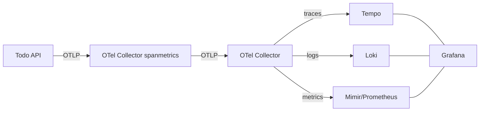

## はじめに

みなさん、観測してますか 🔭？Observability 界隈で注目されている OpenTelemetry（OTEL: ベンダーに依存しないテレメトリ標準）をきちんと理解したくて、最小の Todo API を題材に、ローカルで Grafana LGTM（Loki: ログ、Grafana: 可視化、Tempo: トレース、Prometheus/Mimir: メトリクス） スタックを利用し観測基盤を組み、コードを触らずにトレース・ログ・メトリクスを観測できるか試してみました。

Observability 周辺は環境を作るのが大変なイメージがあったのですが、Grafana LGTM が全部入りでローカルでも動くので、非常にやりやすかったです。また、アプリ側も Coding Agent が作ってくれたので比較的簡単に準備できました。ぜひ、いろんな人に試してもらえたらと思います。

## GitHub

コードはここにおいてます。詳細はこちらをご覧ください。

https://github.com/optimisuke/hello-otel

## 使ったもの・作ったもの

以下のスタックで作りました。

- **Todo アプリのスタック:** FastAPI（Python Web フレームワーク）+ Uvicorn（ASGI サーバ）+ SQLAlchemy（ORM）+ Postgres（RDBMS）。観測用のコードは書かず、`opentelemetry-instrument` に任せる。
- **Observability スタック:** grafana/otel-lgtm（Grafana: 可視化、Tempo: トレース、Loki: ログ、Prometheus/Mimir: メトリクス）＋ `otel/opentelemetry-collector-contrib`（OTel Collector 拡張版。OTLP を受けて spanmetrics を生成）。

## やったこと

以下の順で作っていきました。

1. **アプリを作る** — Todo CRUD を最小コードで用意（計装コードなし）。
2. **LGTM を起動** — docker-compose で Grafana/Tempo/Loki/Mimir を立ち上げ。
3. **Collector を追加** — otelcol-contrib（OTel Collector 拡張版。OTLP 受信＋加工）を挟み、spanmetrics（トレースからメトリクスを集約する機能）を有効化して app→collector→LGTM に経路変更。
4. **ダッシュボードを用意** — spanmetrics を使った Todo API Overview を Grafana にプロビジョニング。
5. **API を叩いて確認** — `/health` と CRUD を成功/失敗混ぜて実行し、トレース・ログ・メトリクスが見えることを確認。

## 送っているもの

Observability といえば、これですよね。以下 3 つを送っています。

- **トレース**: FastAPI / Uvicorn(ASGI) / SQLAlchemy の自動インストルメンテーション。Tempo で確認。
- **ログ**: Python `logging` を OTLP（OpenTelemetry Protocol: gRPC/HTTP でテレメトリを運ぶ標準プロトコル）送信し、Loki で `{service_name="todo-api"}` を検索。
- **メトリクス**:
  - 自動メトリクス（spanmetrics 系: `traces_spanmetrics_calls_total`, `traces_spanmetrics_latency_bucket/count` など）
  - レイテンシ p95/p99 やルート別 RPS は `traces_spanmetrics_latency_*` から算出。
  - PromQL（Prometheus Query Language）で算出・可視化。

## 見え方

Grafana の画面はこんな感じです。
期待通り、いろんなデータを取れました。

## おわりに

コードを触らずに OTEL でトレース/ログ/メトリクスを集約できることを確認できました。上手くいってよかったです。理解がかなり深まりました。
間違い等あれば、ご指摘お願いします。

## Grafana OTEL-LGTM 参考

https://github.com/grafana/docker-otel-lgtm/
https://grafana.com/blog/2024/03/13/an-opentelemetry-backend-in-a-docker-image-introducing-grafana/otel-lgtm/
https://hub.docker.com/r/grafana/otel-lgtm
