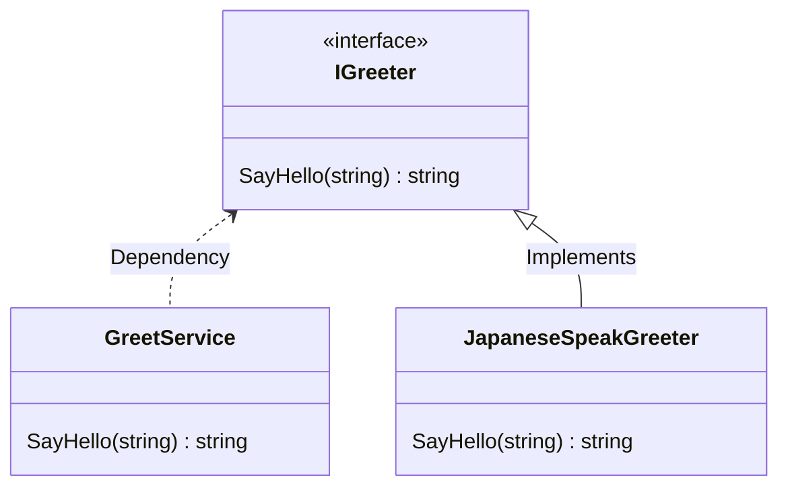

# はじめに

TypeScript で 1. 依存性逆転の原則 と 2. 依存性の注入と(DI: Dependency Injection) と 3. テスト を実施する方法を説明します。
TypeScript で上記 3 つを試してみるときに、試行錯誤しながら試したので、その記録です。
それぞれの概念については、以下の記事を参考にしてください。ここでは記載してません。

依存性逆転の原則と依存性の注入については、この記事がわかりやすかったです。
[「依存性逆転の原則」と「依存性の注入」を完全に理解した - Qiita](https://qiita.com/uhooi/items/03ec6b7f0adc68610426)

依存性逆転の原則と DI と DI Container を色々調べて、ちょっとずつ理解してった感じですが、この記事を読むと、結構理解が深まりました。
成瀬さんて方の本もすごく参考になりました。C#使ったことないですが、それなりに理解できました。
[ドメイン駆動設計入門 ボトムアップでわかる！ドメイン駆動設計の基本（成瀬 允宣）｜翔泳社の本](https://www.shoeisha.co.jp/book/detail/9784798150727)

テストについては、ここを参考にしました。インタフェースを使って依存性を逆転した場合の、mock の作り方が載ってます。
[[TypeScript] Jest でインスタンスのモックを作る方法 - Qiita](https://qiita.com/NeGI1009/items/e90033d1b2bc58a2766d)

コードはここに置いてます。
[optimisuke/hello-di-typescript](https://github.com/optimisuke/hello-di-typescript)

# 書かないこと

下記 3 点は、他の記事または、[GitHub のリポジトリ](https://github.com/optimisuke/hello-di-typescript)参照です。

- 各概念の説明
- DI Container
- `package.json`等の設定ファイル
- IoC (Inversion of Control)

DI Container については、[DI/DI コンテナとは？TypeScript での軽量 DI 実装まで - Qiita](https://qiita.com/tak001/items/83bdb140e2e0df13df09)が詳しかったです。

IoC については、[Wikipedia](https://ja.wikipedia.org/wiki/%E5%88%B6%E5%BE%A1%E3%81%AE%E5%8F%8D%E8%BB%A2)に記載がありますが、これを読んでも依存性逆転の原則との違いがいまいち分かりませんでした。

下記 Stack Overflow を読むと、IoC はフレームワークの文脈で使われる言葉みたいです。ただ、言葉的に too generic で広い意味で使われすぎてるから、Martin Fowler さんが、Dependency injection って言葉を使い始めたみたいです。分かったような分からんような…。DI Container は IoC Container っても呼ばれたりしますが、DI Container って呼ばれるべきだろうみたいなことも書かれてました。

[ioc container - Difference between "Inversion of Control", "Dependency inversion" and "Decoupling" - Stack Overflow](https://stackoverflow.com/questions/3912504/difference-between-inversion-of-control-dependency-inversion-and-decouplin)

言葉が出来た歴史的経緯で、違いがありつつ、概念が重複してるだけなので、細かいことはそこまで気にしなくてもいいかなと思いました。

# コード

いくつかのクラスとインターフェースの関係を以下の図に示します。



依存性逆転の原則を実現するために、上位レイヤーにいる`GreetService`は`interface`である`IGreeter`に依存するようにしました。また、`JapaneseSpeakGreeter`は`IGreeter`を実装しています。
抽象的なインターフェースを介して呼び出すことで、依存関係を逆転しています。

コードは以下の通りです。`interface`を`greetService.ts`の中に書くことで、ファイル間の依存関係を逆転しています。

```ts:greetService.ts
export interface IGreeter {
    SayHello: (name: string) => string;
}

export class GreetService {
    greeter: IGreeter;
    constructor(
        greeter: IGreeter
    ) {
        this.greeter = greeter;
    }
    SayHello = (name: string) => {
        return this.greeter.SayHello(name);
    }
}
```

下位レイヤーの`greeter.ts`はこんな感じになります。
実装として`EnglishSpeakGreeter`と`JapaneseSpeakGreeter`の二つを記載しました。

```ts:greeter.ts
import { IGreeter } from "./greetService";

export class EnglishSpeakGreeter implements IGreeter {
    SayHello = (name: string) => {
        return 'Hello ' + name;
    }
}
export class JapaneseSpeakGreeter implements IGreeter {
    SayHello = (name: string) => {
        return 'こんにちは ' + name;
    }
}
```

最後に、上記クラスの呼び出し部分です。
`IGreeter`の実装を 2 つ作ったので、それぞれ別のインスタンスを生成し呼び出してみました。
constructor で初期化しているので、Constructor Injection パターンに当てはまるのかなと思います。

```ts:index.ts
import { EnglishSpeakGreeter, JapaneseSpeakGreeter } from "./greeter";
import { GreetService } from "./greetService";

const greeter1 = new JapaneseSpeakGreeter();
const greetService1 = new GreetService(greeter1);
console.log(greetService1.SayHello('世界'));

const greeter2 = new EnglishSpeakGreeter();
const greetService2 = new GreetService(greeter2);
console.log(greetService2.SayHello('World'));
```

上記のように DI を実装すると、注入した下位レイヤーのクラスのモックを作りやすくなります。Jest を使った場合、下記のような書き方になります。
`toHaveBeenCalledWith()`を使うことで、呼び出されたときの引数のチェックも可能になります。

```ts:greetService.test.ts
import { GreetService, IGreeter } from "./greetService";

describe('GreetServiceのテスト', () => {
    const mockSayHello = jest.fn(() => {
        return 'fuga'
    })
    const MockGreeter = jest.fn<IGreeter, []>().mockImplementation(() => {
        return {
            SayHello: mockSayHello
        }
    })
    it('SayHello 正常系', async () => {
        const mg = new MockGreeter();
        const gs = new GreetService(mg);

        const received = gs.SayHello('hoge');
        console.log(received);
        const expected = 'fuga';
        expect(received).toEqual(expected);
        expect(mockSayHello).toHaveBeenCalledWith('hoge');
    });
});
```

実際に動かすときに必要な、`package.json`とか`jest.config.js`とかは、下記に置いてるので、動かしたければ是非。
[optimisuke/hello-di-typescript](https://github.com/optimisuke/hello-di-typescript)

# おわりに

シンプルですが、TypeScript を使って依存性逆転の原則と DI とテストを実装した時のコードを説明してみました。
IoC と依存性の逆転（Dipendency Inversion）との違いが分かってなかったので、真面目に調べれたのが良かったかなと思います。
