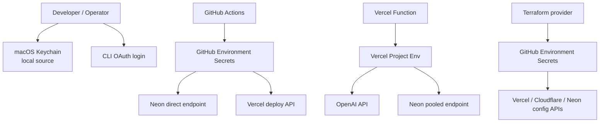
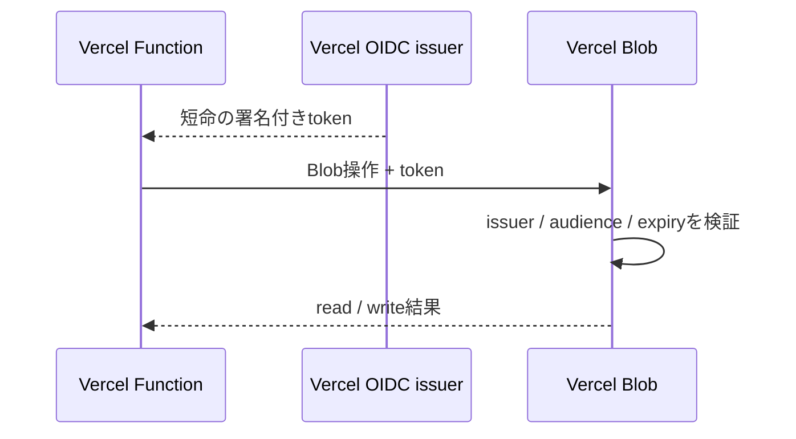
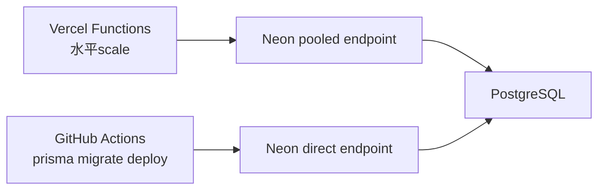
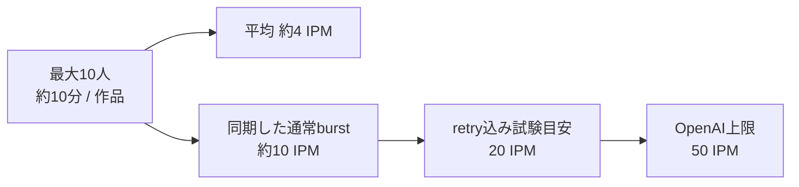
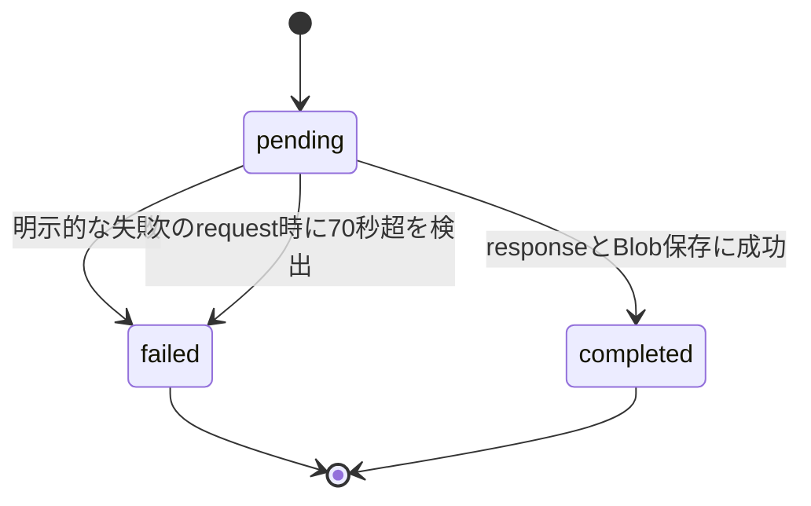
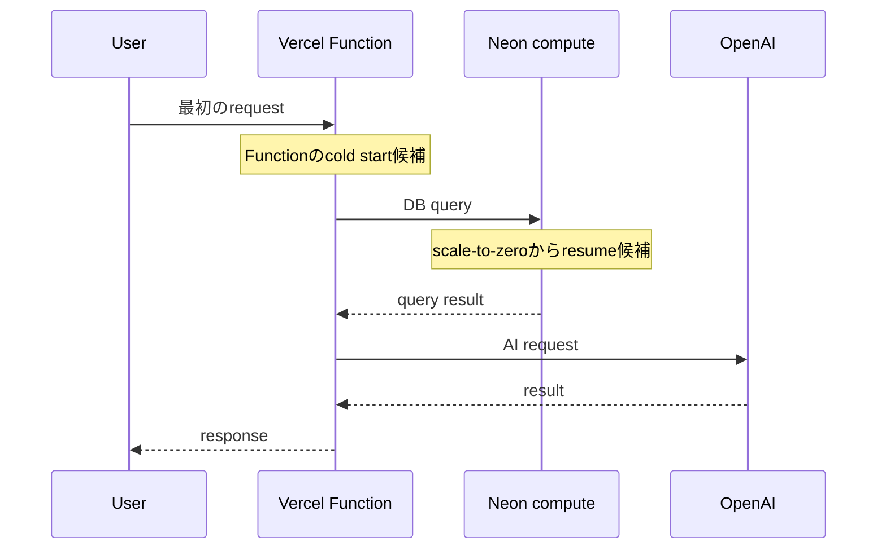

# Vercel・Neon・OpenAIを安全に運用するSecretとスケール設計

## はじめに

Vercelへのapplication deployが動いても、運用設計はまだ終わりません。OpenAI API key、Neonの接続URL、Vercel deploy token、Terraform provider token、ローカルCLIのOAuth credentialは、すべて「Secret」に見えて用途が異なります。

移行中も、次の疑問が順番に出ました。

- 短命OIDCとは何か。固定keyは全部不要になるのか
- OpenAI API keyをMacにどう保存するのか
- Neonのpooled URLとdirect URLをなぜ分けるのか
- `gpt-image-2`の50 IPMで、10人のワークショップは足りるのか
- Vercel Functionの`maxDuration`はplan上限なのか、アプリの制限なのか
- Serverlessのcold startとNeonのscale-to-zeroが重なるとどうなるのか
- Hobby/Freeの短いlog保持で何を観測できるのか

これらを個別設定として処理すると、同じcredentialを複数箇所へコピーしがちです。本記事では、まず「誰が、どこから、何のために使うか」でSecretを分類し、その後にDB、AI rate limit、timeout、observabilityを最大10人のワークショップへ落とし込みます。

## 前提

対象は、人とAIが交互に絵を描いて4コマ漫画を作るNext.jsアプリです。

| 項目 | 構成・想定 |
|---|---|
| Hosting | Vercel Hobby / Functions (`sin1`) |
| DB | Neon Free / PostgreSQL (`aws-ap-southeast-1`) |
| Storage | Private Vercel Blob (`sin1`) |
| AI | OpenAI API、text/visionと`gpt-image-2` |
| 利用規模 | 最大10人、約10分で1人1作品 |
| 画像処理 | 1作品あたり最大4 request |
| OpenAI image limit | 確認時点で50 images per minute |
| Route上限 | application側で`maxDuration = 60`秒 |

plan、rate limit、log保持、model名は変わり得ます。公開時にはDashboardと公式ドキュメントで再確認します。

## Secretは「置き場所」より「利用主体」で分ける

最終的な配置は次のようになりました。



| 保存先 | 入れるもの | 入れないもの |
|---|---|---|
| Vercel Project Environment Variables | OpenAI key、runtime用Neon pooled URL、app認証 | Terraform token、migration direct URL |
| GitHub Environment Secrets | Vercel CLI token、Terraform token、migration direct URL | browserへ渡る値 |
| GitHub Variables | Project ID、Organization/Workspace名、domain | token、password、connection URL |
| Terraform remote state | resource IDと構成 | runtime Secret、Neon role password |
| macOS Keychain | ローカル投入元、環境別のkey/password | repositoryへcommitする値 |
| `.env.local` | ローカルapplication用 | Git管理、チャットや作業logへの貼り付け |
| CLI OAuth storage | 人が行うVercel/Neon/Wrangler操作 | CI credentialへの流用 |

「Terraformで全部管理すれば一元化できる」という案は採用しませんでした。SecretをTerraform resource属性にするとstateへ保存され、stateを読める主体へ露出範囲が広がるためです。NeonもProject、branch、databaseなど非秘密resourceだけIaC化し、role/password/connection URLは別経路にしました。

## MacではKeychainを投入元にする

ローカルでOpenAI keyを用意したとき、最初はshell変数へ入れて`export`しようとして混乱しました。shell変数と環境変数は別であり、別terminalにも自動では引き継がれません。さらに、keyをshell historyやメモへ残すのは避けたいところです。

そこでmacOS Keychainへ、用途と環境が分かるservice名で保存しました。以下は値をソースへ埋め込まない例です。

```bash
# OPENAI_KEYは対話的に読み込んだ一時変数を想定する。
security add-generic-password \
  -U \
  -a "$(id -un)" \
  -s "<application>-openai-preview" \
  -w "$OPENAI_KEY"

unset OPENAI_KEY
```

すでに同じservice/accountが存在すると`The specified item already exists`になります。上書きするなら`-U`を付け、service名とaccountを同じ組み合わせにします。似た名前の項目を増やして「どちらが現行か分からない」状態にしないことが大切です。

Vercelへ投入するときも、keyを`echo`で表示せずKeychainから標準入力や一時環境変数へ渡し、処理後にunsetします。ProductionとPreviewは別項目にしました。

注意点として、AI agentは`.env.local`を読んだり手編集したりしない運用にしました。Secret値を扱う最後の対話操作は人が行い、agentはキー名、配置、検証結果だけを扱います。この境界は少し手間ですが、チャットやtool outputへ値が混ざる事故を減らせました。

## 短命OIDCは「固定Secretを全部なくす魔法」ではない

Vercel BlobのProject接続では、短命OIDCを優先しました。

OIDCは、Vercelが「このProject / Environment / Functionからの実行である」と署名した短命tokenを発行し、対応サービスがissuer、audience、有効期限を検証する仕組みです。



長期間有効なBlob tokenを人がコピーして保存・rotationする範囲を減らせます。一方、次のcredentialはOIDCだけでは消えません。

- OpenAI API key
- NeonのDB password / connection URL
- GitHub ActionsがVercel CLIに渡すdeploy token
- Terraform provider token

対応しているサービス間でのみ成立するためです。

ローカルでも注意が必要でした。現行Vercel CLIは`vercel env pull`だけでなく、`vercel link`でも短命`VERCEL_OIDC_TOKEN`を取得して`.env.local`を更新することがあります。`link`はProject IDを作るだけのread-only操作だと思い込まず、local envへ影響する操作として扱います。

## CLI loginとCI tokenを混ぜない

認証方法を次のように分けました。

| Tool | ローカル | CI |
|---|---|---|
| Vercel | 対話`vercel login` | GitHub Environmentの`VERCEL_TOKEN` |
| Neon | 対話`neon auth` | migration URL / Terraform用API key |
| Wrangler | OAuth + OS keychain | zone限定Cloudflare API token |
| Terraform / HCP | `terraform login` | CI専用・期限付きtoken |

WranglerはこのapplicationをCloudflare Workersへdeployするためではなく、account確認や将来用途のために導入しました。DNS変更の正はTerraformです。複数のCLIとDashboardが同じDNSを自由に変更できる状態にはしません。

実際、Neon CLIのOAuth credentialが失効し、migrationが接続前に止まったことがありました。ここでDB passwordを新しく作り直すのではなく、人が`neon auth`をやり直し、対象Organization/Projectを確認してから再開しました。

またTerraform用Neon API keyでは2つ詰まりました。

1. GitHub Secret名は`NEON_API_KEY`だったが、providerが読む環境変数は`NEON_TOKEN`だった
2. 最初のkeyが別Organizationにscopeされ、importが`project not found`になった

workflowで明示的にmappingし、対象OrganizationへscopeしたCI専用keyへ交換しました。

```yaml
env:
  NEON_TOKEN: ${{ secrets.NEON_API_KEY }}
```

名前が似ていても、Secret storeのキー名、SDK/providerが読む環境変数名、credentialのresource scopeは別々に確認する必要があります。

## Neonはruntimeとmigrationで接続先を分ける

Vercel Functionのruntimeにはpooled URL、`prisma migrate deploy`にはdirect URLを使います。



Serverlessではinstance数に応じてconnectionが増えます。このアプリはapplication側のpool上限を小さくし、初期値を2にしました。Functionが水平scaleしても、各instanceが大きなpoolを持ってNeonのconnection上限を使い切らないためです。

migrationはschema lockやsessionの性質上、pooler越しではなくdirect connectionを使います。GitHub `preview` / `production` Environmentにそれぞれ`DATABASE_URL_DIRECT`を置き、Preview jobからProduction DBへmigrationしないようにしました。

NeonのProductionとPreviewはbranch/databaseを分離しています。旧Azureデータは復元せず、新しい空の環境として開始しました。

## 50 IPMを「何人使えるか」へ翻訳する

OpenAI Dashboardでは`gpt-image-2`に次の上限が表示されていました。

```text
800,000 TPM
50 images per minute
```

画像生成でまず見るのはIPM（images per minute）です。50 IPMは「同時接続50人」でも「1分に50作品」でもなく、1分間に受け付けられる画像処理数です。

このアプリでは1作品に最大4回の画像処理があります。

- 人が描いた1・3コマ目の写真感除去: 2回
- AIが描く2・4コマ目: 2回

最大10人が約10分で1作品を作る想定なので、平均は次のとおりです。

```text
10人 × 4画像処理 ÷ 10分 = 約4 IPM
```

参加者の進行が完全には揃わないため、平均だけなら十分余裕があります。ただしワークショップでは説明後に全員が同じボタンを押し、requestがburstしやすくなります。



初期運用では、retryを含む負荷試験目安を20 IPMに置きました。50 IPMへ2倍以上の余裕を残せるため、最初からRedisや分散queueは追加しません。

ただし次の場合はglobal limiter / queueを再検討します。

- 10人を超えるイベントを行う
- 20 IPM超が継続する
- 429を実測する
- 1作品あたりの画像処理回数を増やす

OpenAIのusage tierはProjectを新しく作るたびにゼロへ戻るというより、account/organization側の利用実績と制限を確認する必要があります。新しいProjectのDashboardでも、実際のmodel別limitを必ず確認します。「Tier 3だから大丈夫」と名称だけで判断せず、対象modelのIPMとTPMをアプリのrequest数へ換算するのがポイントです。

## 429と`Retry-After`は「自動再生成の命令」ではない

providerから429が返った場合、Route Handlerは429と検証済み`Retry-After`をbrowserへ返します。`Retry-After`は、次にrequestを試すまで待つ時間の目安です。「その秒数後に同じ課金処理を必ず自動実行せよ」という機能ではありません。

画像APIでは、provider側で生成に成功した後にresponseだけ失われたケースをapplicationから判別できないことがあります。無条件に再送すると、同じ画像を二重生成して費用とrate limitを消費する可能性があります。

そこで次の順にしました。

1. PostgreSQLで課金requestを冪等化する
2. 進行中の重複requestには`409 + Retry-After: 10`
3. browserは10秒ごと、最大8回だけ同じ状態を確認する
4. 通常requestはOpenAIの完了をそのまま待つ
5. timeout後は自動再生成しない
6. 利用者が「もう一度ためす」を押した場合だけ新しいattemptにする

ただし、記事化のため実コードを再照合したところ、`generationAttempt`はrequestと生成ログには含まれる一方、執筆時点では冪等性keyの材料から漏れていました。このままでは明示再試行も同じfailed keyへ当たり得ます。上記は目標設計であり、公開前にkey生成と回帰testを修正する必要があります。完成形だけを説明していたら見逃していた、文書化による監査の収穫でした。

timeout時の表示は、技術用語を見せず次のようにしました。

> うまく絵を描けなかったみたいです。もう一度ためしてみてください。

この冪等性設計は別記事で詳しく扱います。

## `maxDuration = 60`はHobbyの限界ではなく自主制限だった

各AI Routeには次を置いています。

```ts
export const maxDuration = 60;
```

当初は「Vercel Hobbyの最大実行時間が60秒」と理解していましたが、確認すると現行Hobby / Fluid Compute側の上限とは一致しませんでした。この60秒はplan上限ではなく、Azureでの実測が約17秒だったことを基準にしたapplication側の自主制限として残しています。

単純に70秒へ延ばす案も検討しました。しかし、timeoutを70秒にすることと、70秒後に誰かが処理を再実行することは別問題です。Vercel Function内で70秒を数える常駐timerを置く必要もありません。

`ImageAiRequest.updatedAt`をPostgreSQLへ保存し、次のrequestが来た時に経過時間を比較します。60秒のFunction実行時間に10秒の余裕を足した70秒を超えた`pending`は`failed / timeout`へ遷移させ、自動再生成はしません。



この設計では時間を数えるためにrequestをblockし続けません。70秒超を判定するのは次に状態へ触れたrequestです。無料ワークショップで管理者復旧jobや常駐queueまで持つより、利用者へ失敗を伝え、明示操作で新しいattemptを作る方が安心感と実装規模のバランスがよいと判断しました。

## 二層のcold startを許容し、イベント前に確認する

Serverless移行では、Vercel FunctionだけでなくNeonもscale-to-zeroします。



Neon Freeでは未使用時にscale-to-zeroするため、最初のDB accessへresume時間が加わります。Vercel側もinstanceがwarmとは限りません。この二層が重なる可能性があります。

今回のワークショップは最大10人で、常時低latencyを保証する有償サービスではありません。次を許容条件にしました。

- 有償SLAを要求しない
- イベント開始前にlogin、DB read、1回の生成をwarm-up兼health checkする
- 最初の1人だけ遅くならないよう、開始前に運営側が動作確認する
- 実測p95が体験を損なう場合に初めてscale-to-zero設定やplanを見直す

最初から常時稼働へ課金するのではなく、イベント前チェックで扱えるかを実測する方針です。

## Hobby/Freeでのobservability

初期観測は次の3層です。

| 層 | 観測対象 |
|---|---|
| Vercel Observability / Runtime Logs | Function error、status、duration |
| Neon metrics/logs | connection、compute、DB error |
| PostgreSQL `AiGeneration`等 | model、prompt snapshot、成功/失敗、処理状態 |

HobbyのRuntime LogsやNeon FreeのUI履歴は短く、長期監査基盤としては使えません。イベント中の即時調査と、application DBへ残す生成履歴を役割分担します。

既存applicationにはOpenTelemetry instrumentationがあります。ただし`OTEL_EXPORTER_OTLP_ENDPOINT`が未設定ならno-opです。本番のpromptや生成結果を外部collectorへ送る範囲、保持期間、費用を決めるまでは有効化しません。

将来Vercel native tracingへ寄せる場合は、`@vercel/otel`と既存の手動Node SDKが二重起動しないかを先に評価します。observability packageを追加しただけで安心せず、何を保存し、誰が見られ、何日残るかを決める必要があります。

## スケーリング時に共有状態をmemoryへ置かない

Vercel Functionは水平scaleするため、次の状態をinstance memoryだけへ置きません。

- loginの失敗回数
- 画像生成の冪等性keyと`pending/completed/failed`
- 作品とprompt revision
- image object key

これらはPostgreSQLまたはBlobへ置きます。たとえばlogin throttleは会場NATを考慮し、同一接続元で15分20回の失敗後に15分blockします。IP addressそのものではなく、`APP_AUTH_SECRET`によるHMAC fingerprintを保存します。

一般的な「5回失敗でlock」をそのまま採用しなかったのは、最大10人が同じ会場Wi-Fi/NATを共有するためです。securityの定石を利用文脈へ調整しました。

DB障害時にlocal JSONへfallbackして成功扱いにもしません。Serverlessのlocal filesystemはinstance間で共有されず、消える可能性があります。Productionでは明示エラーにして、共有状態が壊れたまま処理を続けない設計です。

## 採用したtrade-off

### Redisやqueueを初期導入しない

大規模なburst吸収には有効ですが、最大10人・平均4 IPMのワークショップには運用対象が増えます。PostgreSQLの冪等性と有限pollingで開始し、20 IPM超や429実測を追加条件にしました。

### Secretを複数storeへ分ける

一覧性は下がります。一方、runtime、CI、Terraform、local operatorで漏えい範囲とrotation単位を分離できます。配置表と命名規則を文書の正にしました。

### Neon Freeのscale-to-zeroを許容する

最初のrequestが遅くなる可能性があります。常時費用を抑える目的と利用頻度を優先し、イベント前warm-upと実測で補います。

### timeout後に自動再生成しない

利用者には再操作が必要です。しかし画像APIの処理結果が不明なまま自動再送し、二重課金するより、失敗を明示して新しいattemptを人が開始する方が安心感があります。

## 運用チェックリスト

### Secret

- [ ] Production / PreviewでOpenAI key、DB URL、app認証値が分離されている
- [ ] `.env.local`、shell history、Actions logへ実値が出ていない
- [ ] Keychain項目のservice名とaccountが一意で、古い項目を整理した
- [ ] CLI OAuth credentialをCIへ流用していない
- [ ] tokenは用途別・環境別で、期限とrevoke手順がある
- [ ] Terraform stateにruntime SecretやNeon role passwordがない
- [ ] `vercel link` / `env pull`前に`.env.local`への影響を把握している

### Database / scale

- [ ] runtimeはpooled URL、migrationはdirect URLを使っている
- [ ] Preview jobがProduction DBへ接続できない
- [ ] connection pool上限 × Function instance数を監視している
- [ ] login throttleと冪等性状態がPostgreSQLで共有される
- [ ] DB障害をlocal JSON成功へfallbackしない
- [ ] イベント前にNeon resumeを含むhealth checkを行った

### OpenAI / observability

- [ ] 対象Projectのmodel別IPM/TPMをDashboardで確認した
- [ ] 10人相当・最大20 IPMの負荷試験を行った
- [ ] 429と`Retry-After`をbrowserまで保持できる
- [ ] timeout後に同じ課金requestを自動再送しない
- [ ] `generationAttempt`が冪等性keyへ含まれ、明示再試行だけ新keyになる
- [ ] Vercel / Neon usage、error、OpenAI usageをイベント中に確認できる
- [ ] promptや利用者画像を外部telemetryへ送る範囲を合意した
- [ ] Runtime Logsの保持期間を長期監査と誤認していない

## 公開前TODO

- [ ] OpenAI `gpt-image-2`の最新IPM/TPM、usage tier、rate-limit headerを公式情報で確認する
- [ ] Vercel Hobbyの最新Function duration、Runtime Logs保持、Observability条件を確認する
- [ ] Neon Freeのscale-to-zero、compute、connection、metrics/log保持、restore制限を確認する
- [ ] Vercel Blob OIDCのTTLとlocal取得方法を最新公式情報へ合わせる
- [ ] 最大10人の負荷試験でIPM、429率、p50/p95生成時間を記録する
- [ ] cold状態とwarm状態でlogin / DB read / 画像生成時間を比較する
- [ ] Productionでbudget alert、token rotation、障害時連絡手順を確認する
- [ ] 画面・log・コマンド例から実key、email、Project/Organization IDを除去する
- [ ] OTelを有効にする場合、個人情報・prompt・画像の送信と保持をレビューする

## まとめ

Vercel・Neon・OpenAIの運用では、Secret、scale、rate limitを別々に考えるとうまくつながりません。Functionが水平scaleすればDB connectionと共有状態が問題になり、Neonがscale-to-zeroすればcold startが増え、画像APIをretryすればIPMと費用を同時に消費します。

今回の構成では、Secretを利用主体で分離し、runtimeはpooled DB、migrationはdirect DB、画像処理はPostgreSQLで冪等化しました。最大10人・10分で1作品という具体的な利用条件から平均4 IPM、試験目安20 IPMを導き、50 IPMに余裕がある間はRedisやqueueを増やさない判断をしました。

AIとの対話で特に役立ったのは、「短命OIDCって何？」「誰が70秒を数えるの？」「50 IPMは10人で足りる？」という素朴な疑問を飛ばさなかったことです。抽象的なベストプラクティスを、実際の参加人数、待ち時間、失敗時の安心感へ翻訳したことで、過剰設計と危険な自動retryの両方を避けられました。

Serverless運用の安全性は、サービス名やplan名ではなく、credentialの利用主体、共有状態の置き場所、1回の操作が消費するquotaを具体的に数えるところから作れます。
