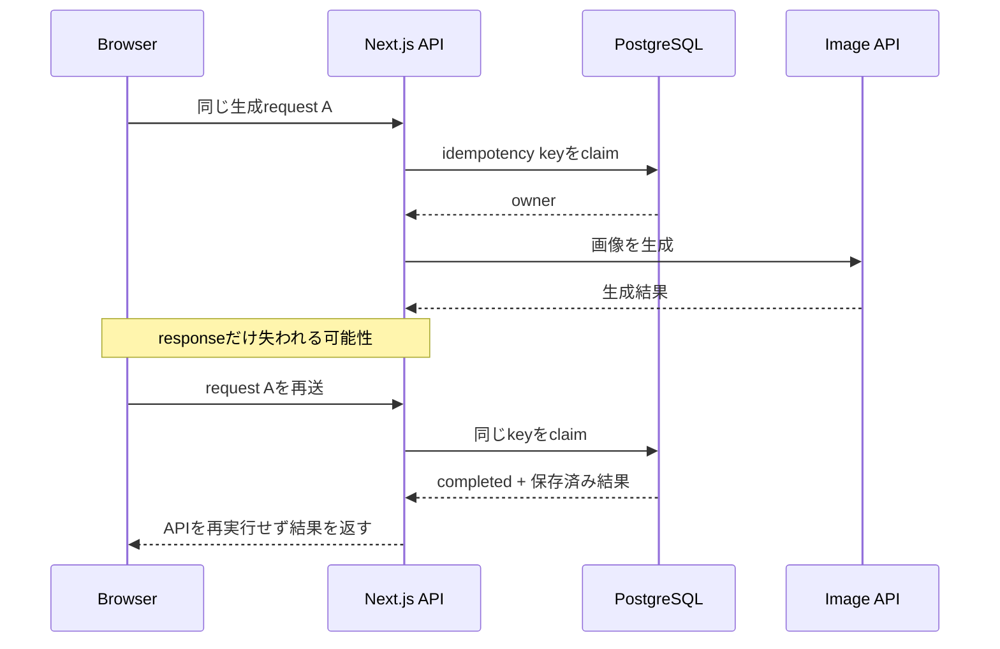
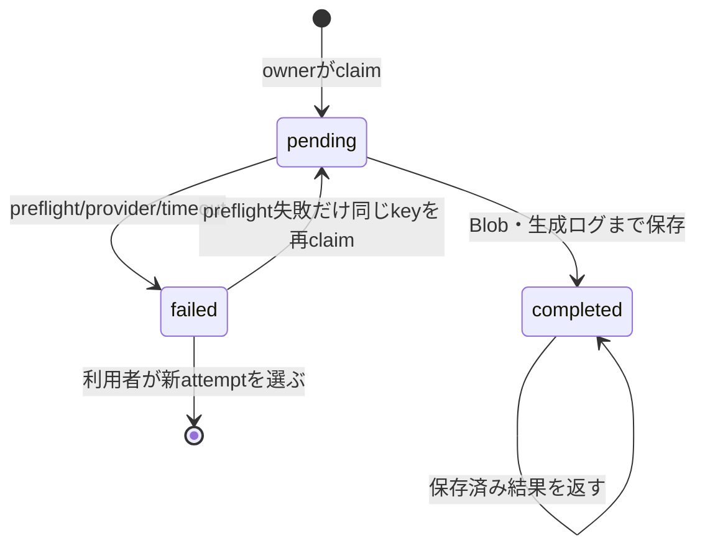

# 画像生成APIの二重課金をPostgreSQLの冪等性で防ぐ

画像生成APIは、HTTP requestが失敗したからといって、生成処理まで失敗したとは限りません。画像は完成して課金もされたのに、Functionのtimeoutや通信切断でresponseだけ届かないことがあります。その状態で同じrequestを素直にretryすると、同じ画像をもう一度生成して二重に課金されます。

この記事では、Next.js + OpenAI API + Neon PostgreSQLの小規模なワークショップ向けアプリで、画像生成のownerを1つに絞り、完了結果を再利用する仕組みを実装した過程を紹介します。最終的に採ったのは、Redisやqueueを増やさず、既存のPostgreSQLへ`pending / completed / failed`を保存する方式です。

## 問題は「retryするか」だけではなかった

二重生成の入口はいくつもあります。

- 利用者が生成ボタンを二度押す
- Reactの画面遷移や再読み込みで同じeffectが走る
- Vercel Functionのresponseが失われ、ブラウザが再送する
- providerが画像を生成した後、Blob保存や生成ログ保存に失敗する
- rate limit対策としてserverが自動retryする

特に厄介なのは、provider呼び出しを開始した後の失敗です。こちらからは「生成されなかった」と「生成されたがresponseを受け取れなかった」を区別できません。



## 最初に検討した選択肢

| 選択肢 | 良い点 | 今回見送った理由 |
|---|---|---|
| ブラウザのボタンだけ無効化 | 実装が小さい | 再読み込み、複数tab、Function再試行を防げない |
| server内で自動retry | 一時障害から回復しやすい | provider完了後の応答喪失で二重課金し得る |
| Redisの`SET NX` | 短いlockには適する | 結果と失敗履歴の永続化が別系統になり、運用対象も増える |
| 分散queue | concurrency、retryを集中管理できる | 最大10人の短時間ワークショップには過剰 |
| PostgreSQLの一意制約 | 既存DBだけでowner、状態、結果を共有できる | 高頻度・超低遅延用途ではRedisより重い |

当初は「Redisの方が一般的では？」という疑問もありました。しかしこのアプリは既にNeon PostgreSQLを使い、想定負荷は最大10人、1人約10分で1作品です。画像処理は平均約4 IPM、通常のburstも約10 IPMなので、専用Redisを追加するほどのwrite頻度ではありません。

さらに必要なのは短いlockだけでなく、`completed`の結果を後から再取得し、`failed`の理由を運用で調べられることでした。既存のtransaction境界と同じPostgreSQLへ置く方が、整合性と運用コストの釣り合いがよいと判断しました。

## 状態を3つ、失敗理由を別列にする

状態名を増やしすぎず、処理のライフサイクルを3つに揃えました。



`timeout`をstatusに足す案もありましたが、そうすると「処理状態」と「失敗分類」の粒度が混ざります。そこでstatusは`pending / completed / failed`、詳細は`failureCode`、同じkeyを安全に再claimできるかは`retryable`へ分離しました。

実際のschemaは概ね次の形です。

```prisma
model ImageAiRequest {
  idempotencyKey String   @id
  kind           String
  status         String   @default("pending")
  draftId        String?
  position       Int?
  resultJson     String?
  failureCode    String?
  retryable      Boolean  @default(false)
  createdAt      DateTime @default(now())
  updatedAt      DateTime @updatedAt

  @@index([status, updatedAt])
}
```

## keyは「同じ生成要求」を表す

keyはrandom UUIDではなく、要求内容をSHA-256へ正規化した値です。

```ts
export function createImageRequestKey(input: unknown) {
  return createHash("sha256")
    .update(JSON.stringify(input))
    .digest("hex");
}

const key = createImageRequestKey({
  draftId,
  generationAttempt,
  kind,
  planGenerationId,
  position,
  prompt,
  styleReferenceBlobPaths,
});
```

ここで示した`generationAttempt`は設計上必要な材料です。執筆時点の実装を記事と照合すると、requestの解析と生成ログにはattemptが入る一方、`createImageRequestKey`へ渡すobjectからは抜けていることが分かりました。このままではtimeout後にボタンを押しても同じfailed keyへ当たり続けます。対話メモの設計を実コードが満たしていると思い込まず、記事化のためにコードを読み直して見つかった不整合でした。公開前に実装とtestを修正します。

画像そのものやprompt本文を冪等性tableへ複製する必要はありません。写真感除去のように入力画像自体で同一性を決めたい場合は、画像内容のdigestだけをkey材料へ加えます。

ここで`generationAttempt`が重要です。同じ画面からの機械的な再送は同じkeyになり、利用者が明示的に「もう一度つくる」を押した場合だけattemptが増えて新しいkeyになります。

## unique conflictをowner選出に使う

最初のrequestだけが主キーをinsertでき、そのrequestをownerとします。同時に来たrequestは一意制約違反になり、既存状態を読みます。

```ts
try {
  await prisma.imageAiRequest.create({
    data: { idempotencyKey, kind, draftId, position },
  });
  return { state: "owner" };
} catch (error) {
  if (!isUniqueConflict(error)) throw error;
}

const existing = await prisma.imageAiRequest.findUnique({
  where: { idempotencyKey },
});
```

分岐は次のとおりです。

- `completed`: Blob pathとgeneration IDを返し、画像APIを呼ばない
- `pending`: `409`と`Retry-After: 10`を返す
- retry可能な`failed`: 条件付き`updateMany`で1 requestだけownerへ戻す
- retry不可の`failed`: 明示失敗として返し、自動生成しない

`updateMany`のwhere条件にも古いstatusと`retryable`を含めることで、複数requestが同時に再claimするのを防ぎます。

## pendingを誰が70秒数えるのか

設計中に一番イメージしづらかったのがここでした。最初は「70秒後に自動再実行する」「ブラウザが70秒を数える」と考えましたが、どちらも採用していません。

常駐timerもcronも長時間transactionも置かず、**次のrequestが来た時にDBの`updatedAt`との差を計算**します。

```ts
const staleBefore = new Date(
  Date.now() - IMAGE_REQUEST_STALE_SECONDS * 1000,
);

const timedOut = await prisma.imageAiRequest.updateMany({
  data: {
    failureCode: "timeout",
    retryable: false,
    status: "failed",
  },
  where: {
    idempotencyKey,
    status: "pending",
    updatedAt: { lte: staleBefore },
  },
});
```

70秒はVercel側で設定したアプリの`maxDuration=60`へ10秒の余裕を足した値です。なお、これはVercel Hobbyそのものの最大時間ではなく、このアプリが自主的に置いた上限です。

最初は「60秒なら61秒や70秒で再実行してよいのでは」と考えました。しかしprovider側だけ成功している可能性は消えません。70秒経過は「古いownerを失敗へ確定する」根拠であって、「もう一度課金してよい」根拠ではない、と整理しました。

## Retry-Afterは再生成命令ではない

進行中の重複requestへ返す`Retry-After: 10`は、「10秒後に画像APIをもう一度呼ぶ」という命令ではありません。「同じidempotency keyの状態を、次に確認してよい目安」です。

ブラウザは最大8回、逐次的に同じrequestを送り直します。ownerが既に完了していれば保存済み結果を受け取り、まだpendingなら再び待ちます。画面を離れたら`AbortController`で待機とfetchを止めます。

```ts
if (response.status === 409 && retries < 8) {
  await waitForRetry(retryAfterMilliseconds(response), signal);
  continue;
}
```

ここも対話を通じて判断が変わりました。10秒間隔の確認は残しましたが、70秒後の**自動再生成**はやめました。timeoutなら「うまく絵を描けなかったみたいです。もう一度ためしてみてください。」と表示し、利用者の操作でだけ新attemptを開始します。

ワークショップでは利用者へ無料で提供するため、決済サービスほど厳密な補償処理は不要です。それでも自動で同じ画像を何度も作るより、失敗を分かりやすく伝えて本人に選んでもらう方が、待っている人の安心感と費用の予測可能性を両立できました。

## 失敗地点でretryableを変える

| 失敗地点 | failureCode例 | 同じkeyの再claim |
|---|---|---|
| provider呼び出し前 | `preflight_error` | 可 |
| provider呼び出し開始後 | `generation_error` | 不可 |
| pendingが70秒超 | `timeout` | 不可 |
| 完了結果JSONが壊れている | `invalid_result` | 不可 |

provider呼び出し前なら課金されていないと判断できるため、同じkeyのretryを許せます。開始後は結果不明なので許可しません。この境界を`providerCallStarted`で記録しています。

## テストで確認すること

少なくとも次を自動化しました。

- 同じkeyを同時claimしてもownerは1つだけ
- pending中は画像APIを呼ばず`409 + Retry-After`
- completedならPrivate Blobの結果を返し、画像APIを呼ばない
- 70秒超のpendingはfailed/timeoutになり、自動生成しない
- preflight失敗だけが同じkeyを再claimできる
- providerの429と`Retry-After`を別の502へ潰さない

一方、公開前には実サービスを使った「provider成功後にresponseだけ落ちた」試験も必要です。unit testだけでは外部APIとFunctionの境界を完全には再現できません。

## Trade-offと運用上の注意

- PostgreSQL rowは永久に増えるため、保持期間と削除jobを決める必要がある
- JSON文字列のresultは小さいmetadataだけにし、画像本体はObject Storageへ置く
- key生成にJSON property順序が影響するため、入力objectの組み立てを一箇所へ寄せる
- 70秒は実測p95とFunction timeoutに合わせて調整する
- DB障害時に「冪等性だけ無効化して生成続行」はしない。費用保護を失うためfail closedにする
- 複数region、高いwrite頻度、厳密なqueue順序が必要になったらRedisやmessage queueを再評価する

## 公開前に再確認するTODO

- [ ] Previewで同時送信、response喪失、completed再取得を実測する
- [ ] `generationAttempt`を実際のidempotency key材料へ含め、timeout後の明示再生成testを追加する
- [ ] OpenAI画像生成の最新rate limitと課金仕様を公式情報で確認する
- [ ] Vercel Functionの`maxDuration`と実測p50/p95を更新する
- [ ] `ImageAiRequest`の件数、timeout率、重複生成件数を観測できるようにする
- [ ] 古いrowの保持・削除方針を決める
- [ ] 記事内コードを公開時点の実装と再照合する

## まとめ

画像生成の冪等性は、単なるボタン連打防止ではありません。「providerが仕事を終えたか分からない」という分散システムの曖昧さを、アプリの状態とUXで扱う設計です。

今回の規模では、既存PostgreSQLの一意制約、条件付きupdate、完了結果の再利用で十分でした。70秒は自動retryの時刻ではなく、pendingを失敗へ確定する境界です。そして再生成するかどうかは、システムではなく利用者へ返しました。この区別が、実装をシンプルに保ちながら二重課金を避ける要点でした。
